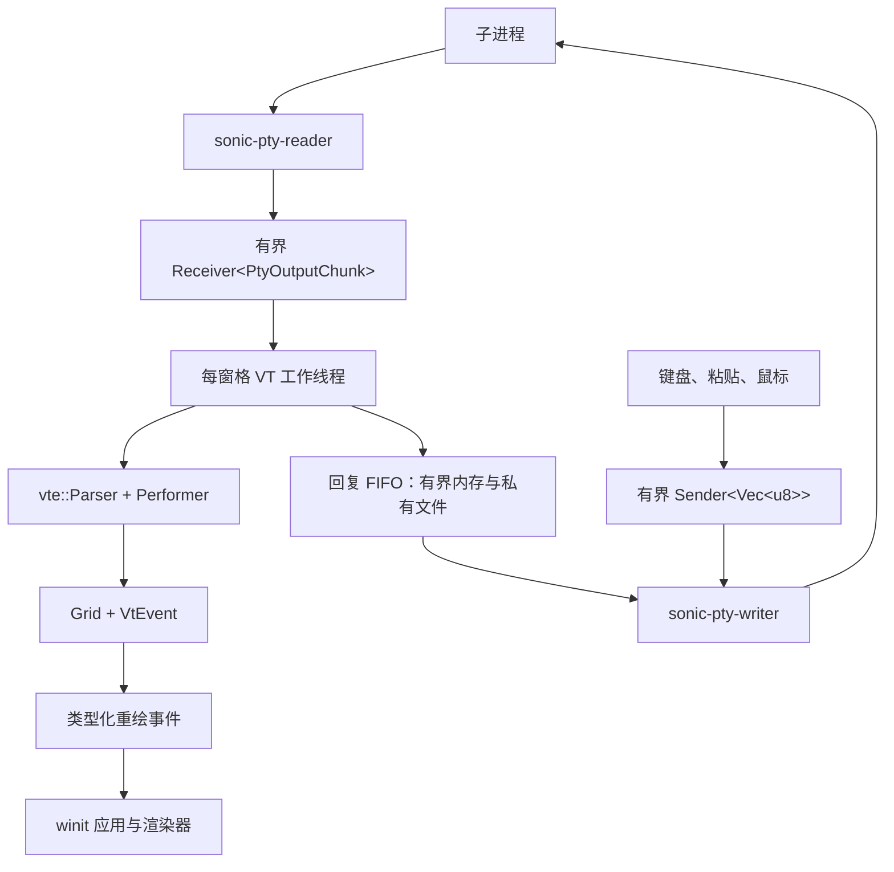

# 终端 IO 与 VT

[English](Terminal-IO-and-VT)

PTY（伪终端）在 SonicTerm 与子程序之间传递字节，解析器把返回字节变成网格单元格与
终端事件。本页说明这条路径和支持的协议；绘制见[渲染与字体](Rendering-and-Fonts-zh-CN)，
资源上限见[内存](Memory-zh-CN)。

### 范围

本地 PTY、解析器、网格、键盘、粘贴、鼠标追踪、选择与复制路径属于跨平台应用行为。
可选 SSH 传输位于 `sonicterm-io/ssh` 功能之后，但发布版 GUI 没有创建 `SshHandle`
的调用点。

### 字节与线程流



读取线程把可复用的 64 KiB `BytesMut` 环形缓冲拆成引用计数的 `bytes::Bytes`
视图。输出通道最多保留 64 个数据块。通道满时读取线程等待，由操作系统 PTY
施加背压，不会继续增长。排队视图最多可固定 64 个不同的环形缓冲，即 4 MiB；
实测普通 shell 工作负载只固定一个 64 KiB 环形缓冲。

终端输入不阻塞。通道最多保存四条 `Vec<u8>` 消息，每条最多 16 MiB。消息过大、
队列已满或写入端断开时，会返回带类型的 `PtyInputError`，其中仍保留被拒绝的字节，
便于重试或显示通知。生产解析器在产生回复的分派后让出执行。VT worker 在解析器与副作用锁外，
把回复提交到独立 FIFO：先使用 64 KiB 内存，溢出后写入私有、自动删除的临时文件。一次分派
暂存小于 32 KiB，由原始 OSC 4 输入的 4 KiB 上限约束。完整分派按最多 32 KiB 合并，并在每个
输出批次结束时刷新；小回复无需每次查询都写文件。提交可能执行同步文件 IO，但不等待
原生输入容量，因此先输出有限查询突发、再读取回复的子进程仍能推进。

现有原生 writer 在 UI 输入与总计最多 32 KiB 的完整回复提交之间选择；长度帧保证键盘字节
不会插入回复内部。每轮回复之后，已就绪的 UI 输入优先获得一次写入机会。两条流各自保持
字节顺序，但不承诺不同生产者之间的顺序。溢出文件不设磁盘用量上限，已消费前缀保留到排空。
排空和 writer 退出会删除文件；窗格销毁立即拒绝新提交。原生 writer 负责最终清理，在事件循环
线程之外等待正在进行的存储操作返回。
磁盘耗尽、暂存读写失败及原生 write/flush 错误均显式报告，不保证这些故障下无损交付。
回复失败不会停止输出解析、重绘合并或子进程退出观察。UI 输入保留非阻塞拒绝行为。
独立解析器的通道式 `advance` API 仍为非阻塞；生产路径使用 `advance_with_replies` 并继续消费剩余字节。

VT 工作线程会先合并输出，再请求一帧。连续 3 ms 没有新数据时刷新尾批次；批次达到
128 KiB 或等待 8 ms 也会刷新。所有窗格构造路径都使用同一个宿主事件处理器。推进解析器
和快照模式时持有该窗格的解析器锁；剪贴板与命令分发、内联媒体解码或缩放以及常驻存储更新
都在释放该锁后执行。线程在短暂加锁时复制当前 `WindowId`，释放锁后发送
`UserEvent::RequestRedraw`。工作线程不调用 AppKit、Win32 或 winit 窗口方法。

### 本地 PTY 契约

`PtyHandle` 拥有子进程、PTY 主端、读写线程、有界通道、已选 shell 路径和尺寸调整
回调。

回调返回 `anyhow::Result<()>`。它把原生调用和最后一次成功应用的 `(cols, rows)`
放在同一把锁后面，因此原生尺寸调整是串行的，缓存记录的是最后一次成功的原生调用：

- 列数或行数为零时，在原生调用之前、也在缓存变化之前，以 `InvalidInput` 错误
  拒绝该请求。
- 与最后一次*已应用*尺寸相同的请求会被跳过，避免多余的 SIGWINCH 或 ConPTY 重排。
- 只有原生调用成功才会缓存该尺寸。因此失败的请求不会被当作重复请求去重：下一次
  相同的请求会再次到达原生调用，而最后一次成功的尺寸仍保留在缓存中。
- 第一次请求一定会到达原生调用。缓存初始为空，不会用 spawn 时的尺寸预填，因此
  没有任何值能与它匹配。

GUI 先调整网格，且在原生调用失败时不回滚：窗格保留用户请求的几何尺寸，只有子进程
看到的尺寸会滞后。`sonicterm-app` 通过 `PaneState::resize_pty` 报告失败，每一轮
连续失败只告警一次——第一次失败会记录窗格 id、请求的列数与行数以及错误，后续失败
保持静默，直到一次成功的尺寸调整清除该闩锁。告警抑制绝不会抑制一次尺寸调整尝试：
只有无效尺寸和成功的重复请求不会到达原生调用，而这两者都由 IO 边界决定，与告警
闩锁无关。

未配置 `[terminal].shell` 时：

- Windows 依次尝试 PowerShell 7（`pwsh.exe`，包括注册安装和 Microsoft Store
  安装）、Windows PowerShell、`cmd.exe`。
- Unix 依次使用可执行的 `$SHELL`、当前用户 passwd 记录中的可执行 shell、`/bin/sh`。
- macOS 正常运行时，zsh/tcsh/csh 使用 `-l`，bash/fish 使用 `--login`。
  干净端到端测试模式则关闭配置文件和启动横幅。

Windows PowerShell 正常启动时，还会在受支持的 PowerShell 7 主机中加载内嵌、仅当前进程
生效的目录链接集成。它保留自定义格式和显式命令；干净端到端启动不会安装该集成。
参见[使用说明](Usage-zh-CN#powershell-目录链接)。

若提供了有效的显式工作目录，子进程从该目录启动；否则在可用时使用 `HOME`。
SonicTerm 设置：

```text
TERM=xterm-256color
COLORTERM=truecolor
TERM_PROGRAM=<配置的 term_program>
TERM_PROGRAM_VERSION=<与终端身份匹配的版本>
```

`TERM_PROGRAM=SonicTerm` 时使用工作区包版本。`TERM_PROGRAM=WezTerm` 时固定报告
与已实现能力匹配的 WezTerm 版本 `20230712-072601`。

释放 `PtyHandle` 时会取消原生 IO、终止子进程、关闭 PTY，并限时回收进程。读写线程
退出和子进程回收的期限是 500 ms。Unix 会终止子进程会话，并在回收主进程前重新
核对后代，避免向已复用的进程号或会话号发信号。最后一次有界发信号/等待之后，重新检查
会话成员以确认完成；仍有成员时，错误会包含观测到的进程 ID。Windows 在关闭 ConPTY 主端时并行
排空一个克隆读取端，关闭期限为 2 s。超时和清理失败会写日志，析构不会无限等待。

主端输入 writer 由同一个内部接缝构建，因此窗格关闭时子进程收到哪些字节只由一处决定。
Unix 上 SonicTerm 通过主端描述符的 close-on-exec 副本写入，关闭该副本是静默的：销毁
writer 不会新增任何合成输入。普通终端输入和解析器生成的应答不受影响——这一收窄很重要，
因为应答是终端自身产生的合法输入。而 `portable-pty` 自带的 Unix writer 在析构时，只要
线路规程报告了 `VEOF`，就会写入一个换行和该 `VEOF`，因此拆除过程会向子进程投递一次
用户未请求的换行和 Ctrl+D。Unix 主端若不提供描述符，则返回错误，而不是回退到那个会注入
字节的 writer。Windows 仍使用 `portable-pty` 的 writer，其 ConPTY 析构不会向子进程
写入任何内容。

该副本与主端共享同一个打开文件描述，因此 `O_NONBLOCK` 等文件状态标志保持共享，此处
也不会修改它们；而 `FD_CLOEXEC` 是每个描述符独立的标志，只设置在该副本上。副本的生命期
是独立的：主端释放后它仍能继续投递，关闭它也不影响其他副本继续可用。显式用户输入不受
影响：用户输入的 Ctrl+D 仍然会结束一个规范模式 shell。

### VT 解析器与协议

`sonicterm-vt::Parser` 包装 `vte::Parser` 与 SonicTerm `Performer`。`Performer`
拥有 `Grid` 和终端属性。状态机处于基态时，会批量插入可打印 ASCII，
直到遇到转义或控制字节。

当前协议支持：

- 光标移动、保存/恢复、插入/删除字符与行、擦除、DECSTBM、反向索引、自动换行、
  光标可见性和形状；
- SGR 样式、索引色、真彩色、下划线样式与颜色，以及按背景色擦除；
- 主屏幕与备用屏幕、应用光标键、括号粘贴、焦点报告，以及 kitty 键盘标志的
  set/push/pop/query；
- OSC 0/2 标题、带主机校验的 OSC 7 工作目录、OSC 8 超链接、OSC 52 剪贴板事件、
  OSC 4/10/11/12 颜色查询、OSC 133 提示符标记；
- DSR、DA、XTVERSION、DECRQSS SGR、调色板和 kitty 键盘回复；
- iTerm2、kitty 与 Sixel 媒体事件。

XTVERSION（`CSI > q`）回复 `DCS > | SonicTerm <version> ST`，其中 `<version>` 是当前运行的版本，
与默认情况下 `TERM_PROGRAM_VERSION` 公布的值相同。即使设置 `term_program = "WezTerm"`，
回复仍使用 `SonicTerm` 名称；该设置只改变子进程环境。

DECRQSS `DCS $ q m ST` 通过终端回复队列报告当前 SGR 样式。回复保留扩展下划线子参数，
包括波浪下划线的 `4:3`，以及前景、背景和下划线的索引色/RGB 颜色。
这使 Neovim 能在 terminfo 缺少 `Smulx` 时发现扩展下划线能力；普通下划线仍保持独立。
扩展颜色接受分号参数和冒号子参数，包括 Neovim 的 `58:2::r:g:b`，且不会吞掉后续 SGR 属性。
无效的冒号颜色分量不会改变当前颜色。固定大小的请求识别状态与 Sixel 捕获分离。不支持但完整的选择器返回失败回复；
已取消、中断或超长的请求不产生状态回复。

`CSI 3 J` 只擦除当前主屏幕的已保存历史，保留可见单元格、光标、样式、滚动边距和
后续历史容量配置。历史为空或备用屏幕处于活动状态时不做任何修改；备用屏幕中的 ED3
绝不触碰已保存主屏幕。ED0/1/2 保持各自的可见屏幕擦除范围。

光标位置 DSR（`CSI 6 n`）始终报告 `1..=cols` 内的物理列，即使插入光标持有延迟
换行哨兵值。重复查询不会消耗待处理换行。LF、VT、FF、IND 和 NEL 共用遵守边距的
硬换行决策：在活动区域底边滚动该区域，否则只在物理边界内向下移动，不滚动受保护行。
LF/VT/FF 使用当前擦除填充，IND/NEL 使用默认填充，只有 NEL 回到第零列。硬换行会
取消延迟换行，并清除目标行的自动换行来源标记。

宿主通过 `Parser::resize` 调整尺寸：沿用网格上限，实际行数或列数变化时重置滚动边距，
包括通过无参数 `CSI r` 设置的边距。相同尺寸的请求保留有效局部区域。尺寸调整不会把
光标移到起点，也不重置样式、键盘协议、现有历史或未完成的转义序列；主屏滚动仍增加
历史，而有效局部区域和备用屏幕的滚动不增加历史。

OSC 的 shell 集成仅限以下范围，不表示完整 WezTerm 对等能力。OSC 0/2/7/8 使用整个
负载最多 16 KiB 的原始收集器，避免 vte 的 16 参数截断。输入必须为无控制字符的有效 UTF-8，
并以 BEL 或完整 `ESC \` 终止。取消或拒绝会清除链接/CWD 信任，但保留此前显示标题。
OSC 8 驻留 URI 仍限 8 KiB、客户端 id 限 1 KiB。


- **OSC 7：** 分开保存解码路径与 authority。本地 CWD 只接受空 authority、`localhost`
  或准确本机主机名，路径必须是原生绝对路径，且解码后 UTF-8 不超过 4,096 字节。
  主窗口和子窗口中的普通新标签页与分屏可继承源窗格已验证的 CWD。显式 CWD 优先；
  新窗口不继承。缺失、无效或远端报告不会授权本地相对路径，也不会改用其它窗格的目录。
- **OSC 8：** 保留包含分号的完整 URI；仅从参数字段提取 `id=`，其它参数不充当客户端 id。
- **OSC 133：** `B` 产生 `PromptEnd`，不启动命令计时；`C` 标记开始执行。
  `A`/`D` 保持已有提示符区域行为。

原始 OSC 4 收集器保留超出 vte 参数数量的查询，上限 4 KiB，并抑制截断的重复回调。
解析器自有序列状态允许 kitty APC 紧跟已完成转义，支持 C1 APC 和跨块 `ESC` / `_`。
有界前缀探测只把已确认的 `OSC 1337;File=` 媒体从 vte 私有 OSC 缓冲接管出来。

单条普通转义序列最多保留 1 MiB；超过后，解析器会一直丢弃到序列终止符，不会把负载
当作可打印文本。Kitty APC、Sixel DCS 与 iTerm2 OSC 1337 改用同一个媒体契约：单个负载
上限为 16 MiB；传输中的捕获共用进程级 64 MiB 暂存池，每个捕获下限为 4 MiB，可保证
13 个并发捕获都获得该下限。无法预留暂存空间时会拒绝整个捕获，不显示任何内容。超大、
已取消或截断的媒体都不会局部显示；取消后，解析器仍会吞掉该负载直到终止符。连续两次
30 s 采样都没有进度时取消捕获，因此声明的停滞时间是一分钟。

### 键盘协议参考

其它按键和修饰键遵循以下规则：

- **Control 与键位优先级：** 配置的键位可能在 PTY 编码前接管组合键。否则先判断 Control，
  再判断 Alt：Control+A 变成 `0x01`，Control+Alt+A 会在该控制字节前加 `ESC`。
  旧式别名覆盖 Space/@/2、`[ /3`、`\ /4`、`] /5`、`^/~/6`、`_/ /7` 和 `?/8`。
- **文本与 BackTab：** 默认旧式模式会在 Alt 文本前加 `ESC`；Shift 与布局相关文本由
  操作系统生成。Tab 发送 HT。在 `modifyOtherKeys` level 1 下，只有普通 Shift+Tab 继续发送
  `CSI Z`；其它带修饰键的 Tab 形式和带修饰键的 Enter 使用
  `CSI 27 ; modifier ; code ~`。level 2 也把 Shift+Tab 编码为
  `CSI 27 ; 2 ; 9 ~`。level 1 保留普通 Shift/Control 别名及 Backspace 例外。
  MOK 报告布局选出的字符，而非 Kitty 的未加 Shift 按键身份。level 2 下，美式布局
  Shift+3 仍发送 `#`；Shift+a 和 Shift+Space 分别发送 `CSI 27 ; 2 ; 65 ~` 与
  `CSI 27 ; 2 ; 32 ~`。带 Shift 的 `{`、`|`、`~` 也保留修饰键报告。Ctrl+Shift+3
  在 level 1 和 2 报告字符35。多码点组合文本保持完整。
- **协商的旧式模式：** pane 快照包含 DECCKM 光标键、DECKPAM 小键盘身份、DECBKM
  Backspace、ANSI newline mode，以及 xterm `modifyOtherKeys` level 1 和 2。带修饰键的
  光标键与功能键会在 xterm 修饰参数中保留 Shift、Alt、Control 和 Super；功能键覆盖到 F35。
- **Kitty 协议：** 主屏和备用屏各自维护独立且有界的 progressive-enhancement 栈。
  不支持的 set mode 不做任何改变，保存的 flag 保留协议的七个数据位。SonicTerm 支持
  消歧义、事件类型、备用按键、全部按键报告、关联文本、功能键和小键盘身份，以及修饰键
  自身的身份。单独启用备用按键报告只会补充原本已经使用 CSI-u 的按键，不会改变原始文本、
  DECKPAM 或 terminfo 编码。启用消歧义时 Shift+Tab 为 `CSI 9 ; 2 u`；程序要求时，重复与
  释放会带 Kitty 事件类型。
- **小键盘：** 默认 `keypad_mode = "auto"` 保留运算符、Enter、导航的协商 DECKPAM
  身份，以及既有的操作系统数字文本例外。显式选择 `numeric` 仅在编码器的快照副本中
  覆盖旧式 DECKPAM：使用包含修饰键和 newline mode 的普通文本/Return 规则，导航采用
  逻辑按键。已保存的终端模式和 Kitty 编码不变；该偏好并不测量硬件 NumLock。

### Windows 原生键盘输入

Windows ConPTY 可用 `CSI ? 9001 h` 请求原生按键记录，用 `CSI ? 9001 l` 关闭请求。
该请求属于整个窗格，不属于主屏或备用屏的 Kitty 栈。当前非零 Kitty flags 优先；显式
Kitty flag 值为零时允许 Win32 输入。未请求时，原有键盘编码不变。RIS 会清除请求。

编码器发送 `ESC[Vk;Sc;Uc;Kd;Cs;Rc_`，所有参数均以十进制显式给出。`Sc` 是原生扫描码
字节，扩展键标志保存在 `Cs`。每个原始 UTF-16 单元产生一条记录，并保留相同的原生
重复次数，不合并为单个 Unicode 标量。没有字符数据的按键产生一条 `Uc=0` 记录。
释放也使用 `Uc=0`：Windows 按键释放消息不带对应字符，SonicTerm 不复用上次按下的
文本。这不表示与其它终端的非零释放字符行为完全一致。

固定版本的 Windows winit 扩展让原生元数据随同一个按键事件经过字符聚合和延迟交付。
焦点合成事件没有原生元数据。无法取得原生元数据时，会拒绝该次原生按键输入并记录诊断，
不会猜测键盘布局或悄悄发送旧式字节。输入法提交和剪贴板粘贴保留独立文本路径；鼠标和
焦点报告不编码成 Win32 键盘记录。

成功接纳的原生按下保留目标窗格及协议代次。有效 Win32 状态变化（包括屏幕独立 Kitty
状态变化）或 RIS 会取消较早的原生按键所有权。跨越这类切换时，按住的键必须先释放再
重新按下；SonicTerm 不向新协议发送旧协议的清理记录。应用在按键仍按住时关闭协议，需
自行处理其剩余按键状态。Win32 仍启用时，失去焦点会为每个已接纳的原生按下发送一次
合成释放，按窗格合并为一次入队，然后清除所有权。清理记录清除按住的修饰键位，保留
被接纳按下时最后已知的锁定键及扩展键位，不重新采样按键状态。重新获得焦点时的合成按下
不会建立新的终端所有权。协议代次达到 48 位最大值后保持饱和并拒绝原生输入，不复用旧
代次。本地快捷键、READONLY 和按广播目标独立选择协议的规则仍然适用。

### 鼠标跟踪与选区

`MouseTracking` 只有一个当前值；各模式不会形成栈：

| DEC 模式 | `MouseTracking` | 报告内容 |
| --- | --- | --- |
| 重置/默认 | `Off` | 指针手势由 SonicTerm 处理 |
| `DECSET ?1000` | `Button` | 按下与释放 |
| `DECSET ?1002` | `ButtonMotion` | 按键事件以及按住按键时的移动 |
| `DECSET ?1003` | `AnyMotion` | 按键事件、按住时移动和无按键移动 |

`?1000`、`?1002`、`?1003` 中最后一次 `DECSET` 生效。对当前模式执行 `DECRST`
会切换为 `Off`；重置非当前模式不做任何事，也不会恢复更早的模式。RIS 同样恢复
`Off`。

TUI 指在终端内运行的全屏文本界面程序。

`DECSET ?1006` 只控制 SGR 鼠标编码，与是否启用跟踪相互独立。`?1006` 生效时，
应用拥有的点击、释放、滚轮和符合条件的移动使用 SGR 报告，否则使用当前旧式报告。
SGR 使用从 1 开始的 `CSI < Cb ; Cx ; Cy M`，释放使用小写 `m`。旧式格式使用
`CSI M` 加三个偏移字节，并把协议坐标限制在 223。滚轮向上、向下分别使用按键码
64、65，不发送释放报告。无论主屏幕还是备用屏幕，只要启用任意跟踪模式，滚轮都会
发送给应用；因此主屏幕跟踪启用时，同一次滚轮事件不会再移动 SonicTerm 的本地回滚
视图。跟踪关闭时，主屏幕滚轮滚动本地历史，备用屏幕滚轮发送方向键。仅启用 SGR
编码不会改变这一后备行为。主窗口和子窗口采用相同的路由规则。

按下时只选择并锁定一个手势所有者：

- 跟踪启用时，无修饰键按下交给 TUI；
- 即使跟踪启用，按住 Shift 开始的手势仍由 SonicTerm 本地选区处理；
- 跟踪为 `Off` 时，手势由本地处理；
- 标签栏、分隔条、滚动条或其它界面先消费按下事件时，不创建终端手势。

手势所有者、按下时的窗格、跟踪模式和 SGR/旧式编码配置会一直锁定到释放。之后的
修饰键、窗格焦点、模式或 `?1006` 变化都不能夺走手势。终端释放报告使用按下时的
窗格和编码配置，以及该窗格内最后一个有效单元格。`Button` 不报告按住移动；
`ButtonMotion` 与 `AnyMotion` 会报告。没有按键按下时，只有当前 `AnyMotion` 会
报告移动，并使用当前窗格与当前编码配置。

选区会绑定所属窗格、单调递增的主/备用屏幕 epoch、内容序列和回滚淘汰基线。
主屏幕滚动会让选中文本进入历史，并重新定位仍存活的端点与当前 drag anchor。
屏幕 epoch 或窗格变化、淘汰已选行，或修改与选区相交的行都会清除选区；无关行变化
与同值重绘不会。即使恢复后的 cell 相同，epoch 也会拒绝“主屏幕→备用屏幕→主屏幕”
的 ABA 切换。渲染前和复制前都会执行检查。

单独按下修饰键（Ctrl、Shift、Alt/AltGr、Win/Super、Hyper 或 Meta）不会清除本地选区，
即使 Win32 或 Kitty 把该键发送为协议记录也一样。其它成功进入终端输入队列的按键仍会
清除选区。通过 AltGr 输入的字符属于文本输入，不是单独修饰键。主窗口和子窗口规则
一致；复制快捷键保留既有的剪贴板成功写入策略。CapsLock、NumLock、ScrollLock、
FnLock 等锁定键不属于这一单独修饰键例外。

显式复制备用屏幕选区时，剪贴板写入成功后清除选区；写入失败则保留，便于重试。
若所选内容已经过期，SonicTerm 会清除选区但不复制，剪贴板保持不变。rmux/tmux 的
mouse ownership 与 OSC 52 实际配置见 [用法](Usage-zh-CN)。

### 网格存储与不变量

`Grid` 拥有可见行、有界回滚、光标与默认单元格状态、脏行、内容序列号、可选的盒装
已保存主屏幕，以及每个屏幕最多 256 个使用回滚绝对坐标的 OSC 133 提示符区域。
备用模式下，主屏幕提示符随主屏幕保存，因此备用屏幕的提示符导航不会复用隐藏的主屏幕
标记。所有历史前缀删除都会丢弃起点已删除的提示符，并重定位仍存活的坐标。非空 ED3
按实际删除行数推进淘汰计数，重绘所有可见行，但不改变它们的内容序号。

精确几何上限为：

- 任一轴最多 4,096 列或行；
- 单个主屏幕或备用屏幕最多 524,288 个可见单元格；
- 可见行、历史和已保存主屏幕合计最多 1,048,576 个单元格；
- 每个单元格最多保存 64 个 UTF-8 字节的组合字符或零宽附加内容。

保留字节的执行目标是 `MAX_GRID_CELLS × size_of::<Cell>()`，当前构建约为 24 MiB。
这是共享网格预算，不是额外再给回滚 24 MiB。配置的 `[terminal].scrollback` 行数
可能先达到上限。每滚动 512 行检查一次保留容量；若压缩仍不能降到目标内，则以每批
64 行删除最老历史。降低配置行数时会立即删除旧行。

双宽字符使用带 `WIDE` 的首单元格和带 `WIDE_CONT` 的续单元格。范围修改会围绕它们
扩展或修复，不能留下半个字形。组合字符附着到前一个首单元格。`Line` 用
`Flat(Vec<Cell>)` 保存任意行，用显著更小的游程 `Cluster(Vec<Cluster>)` 保存重复行；
两种表示的迭代和哈希结果相同。缩小列数时只检查新的最右单元格，在任一存储形式中将
失去续格的 `WIDE` 首格替换为尺寸调整填充。可见行、历史和已保存主屏幕中的完整字符对
保持不变。这不是 reflow：重新扩大行宽不会恢复被裁剪文本，也不会凭空补回续格。

每次内容修改都会推进网格修订计数、标记受影响行并记录内容序列。仅移动光标或改变
呈现状态不会推进内容序列。主屏幕全屏滚动会让行身份随文本进入历史；备用屏幕、无历史
和局部区域滚动则为发生变化的固定屏幕位置重新记录序列。

### 未发布的传输接缝

可选 `ssh` 功能在专用单线程 Tokio 运行时上运行 `russh`，并提供类似 PTY 的输入、
输出和尺寸调整通道。它检查显式密钥或 `~/.ssh/id_ed25519`、`~/.ssh/id_rsa`。
主机密钥会被直接接受，不保存也不在后续连接中比较；没有 ssh-agent、密码或键盘交互
认证。GUI 不创建 `SshHandle`，因此这不是已发布的远程会话功能。

### 代码位置

| 主题 | 主要路径 |
| --- | --- |
| PTY、shell、队列、析构 | `crates/sonicterm-io/src/pty.rs` |
| 可选 SSH | `crates/sonicterm-io/src/ssh.rs` |
| 窗格工作线程与重绘合并 | `crates/sonicterm-app/src/app/spawn_pane.rs` |
| 主窗口/子窗口输入路由 | `crates/sonicterm-app/src/app/{window_event,child_window}.rs` |
| VT 解析器与模式 | `crates/sonicterm-vt/src/vt.rs` |
| 网格与行存储 | `crates/sonicterm-grid/src/{grid,line,hyperlink}.rs` |
| 选区与复制 | `crates/sonicterm-ui/src/selection.rs`、`crates/sonicterm-app/src/app/misc.rs` |
