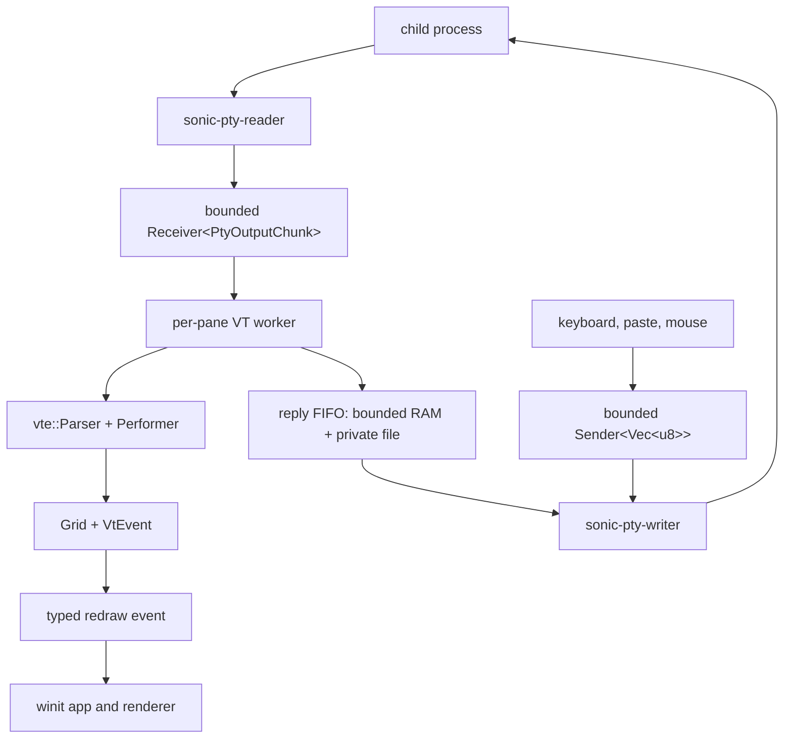

# Terminal IO and VT

[简体中文](Terminal-IO-and-VT-zh-CN)

A PTY (pseudo-terminal) carries bytes between SonicTerm and a child program.
The parser turns returned bytes into grid cells and terminal events. This page
explains that path and supported protocols; drawing is in
[Rendering and Fonts](Rendering-and-Fonts), limits in [Memory](Memory).

### Scope

The local PTY, parser, grid, keyboard, paste, mouse-tracking, selection, and copy
paths are cross-platform application behavior. SonicTerm has no built-in
remote-session transport: a remote shell such as `ssh` runs as an ordinary
program inside a local PTY.

### Byte and thread flow



The reader splits a reusable 64 KiB `BytesMut` ring into reference-counted
`bytes::Bytes` views. The output channel holds at most 64 chunks. A full channel
blocks the reader and lets the OS PTY apply backpressure; it does not grow.
Queued views can pin at most 64 distinct rings, or 4 MiB, although measured
shell workloads pin one 64 KiB ring.

Terminal input is non-blocking. Its channel holds four `Vec<u8>` messages, each
at most 16 MiB. Oversize, full-queue, and disconnected-writer failures return a
typed `PtyInputError` that retains the rejected bytes for retry or a visible
notification. Production parsing yields after a reply-producing dispatch. Outside
parser and side-effect locks, the VT worker submits replies to a separate FIFO:
64 KiB of RAM followed by a private, automatically deleted temporary spill file.
One dispatch stages less than 32 KiB, bounded by the 4 KiB raw OSC 4 input limit.
Complete dispatches are batched up to 32 KiB and flushed at each output-batch end;
small replies do not require a file write per query. Admission may perform synchronous file I/O but never waits for native input
capacity, so a finite output-before-input query burst can continue draining.

The existing native writer selects between UI input and complete reply submissions
fitting a 32 KiB turn; length framing prevents keyboard bytes from splitting a reply.
Ready UI input gets a turn after each reply turn. Each stream preserves its own
byte order; no ordering between the two producers is promised. Spill disk
usage is not capped, and consumed file prefixes remain until the spill drains.
Drain and writer exit remove the file. Pane teardown rejects admissions immediately;
the native writer owns final cleanup and waits for any in-flight storage operation
off the event-loop thread. Storage exhaustion, spool
read/write failures, and native write/flush errors are explicit failures—not
lossless-delivery guarantees. A reply failure does not stop output parsing, redraw
coalescing, or child-exit observation. UI sends retain their non-blocking refusal
behavior. The standalone parser's channel-based `advance` API remains non-blocking;
production uses `advance_with_replies` and consumes its returned suffix.

The VT worker coalesces output before requesting a frame. A quiet interval of
3 ms flushes a trailing batch; a batch also flushes after 128 KiB or 8 ms. Every
pane constructor uses the same host-event processor. Parser advancement and mode
snapshots run under the pane's parser lock; clipboard and command dispatch,
inline-media decode or resize, and retained-store updates run after that lock is
released. The worker copies the current `WindowId` under a short guard, releases
the guard, and posts `UserEvent::RequestRedraw`. Worker threads do not call
AppKit, Win32, or winit window methods.

### Local PTY contract

`PtyHandle` owns the child, PTY master, reader and writer threads, bounded
channels, selected shell path, and a resize callback.

The callback returns `anyhow::Result<()>`. It holds the native call and the last
applied `(cols, rows)` behind one lock, so native resizes are serialized and the
cache records the last successful native call:

- A zero column or row count is refused as an `InvalidInput` error before the
  native call runs and before the cache changes.
- A request equal to the last *applied* size is skipped, avoiding an unnecessary
  SIGWINCH or ConPTY reflow.
- Only a successful native call caches the size. A failed request is therefore
  not deduplicated away: the next identical request reaches the native call
  again, and the last successful size stays cached.
- The first request always reaches the native call. The cache starts empty
  rather than seeded from the spawn dimensions, so nothing can match it.

The GUI resizes the grid first and does not roll it back when the native call
fails: the pane keeps the geometry the user asked for, and only the child's view
of it lags. `sonicterm-app` reports the failure through `PaneState::resize_pty`,
which warns once per failing run — the first failure is logged with the pane id,
requested columns and rows, and the error, and further failures stay silent
until a resize succeeds and clears the latch. Warning suppression never
suppresses a resize attempt: an invalid size and a successful duplicate are the
only requests that do not reach the native call, and the IO boundary decides
both, not the warning latch.

If `[terminal].shell` is absent:

- Windows tries PowerShell 7 (`pwsh.exe`, including registered and Microsoft
  Store installations), Windows PowerShell, then `cmd.exe`.
- Unix uses an executable `$SHELL`, then the current user’s executable passwd
  shell, then `/bin/sh`.
- Normal macOS launches zsh/tcsh/csh with `-l` and bash/fish with `--login`.
  Clean end-to-end mode instead suppresses profiles and banners.

Normal Windows PowerShell startup also loads embedded, process-local directory
links on supported PowerShell 7 hosts. It preserves custom formatting and explicit
commands; clean end-to-end startup does not install it. See [Usage](Usage#powershell-directory-links).

The child starts in an explicit valid working directory when supplied,
otherwise in `HOME` when available. SonicTerm sets:

```text
TERM=xterm-256color
COLORTERM=truecolor
TERM_PROGRAM=<configured term_program>
TERM_PROGRAM_VERSION=<matching terminal version>
```

For `TERM_PROGRAM=SonicTerm`, the version is the workspace package version. For
`TERM_PROGRAM=WezTerm`, SonicTerm advertises `20230712-072601`, the fixed
capability-compatible WezTerm version.

Dropping `PtyHandle` cancels native IO, terminates the child, closes the PTY,
and attempts bounded reaping. Reader and writer shutdown and child reaping use
a 500 ms deadline. Unix kills the child session and rechecks descendants before
reaping the leader, so a reused process or session id is not signalled. The
membership check skips zombies, which need no signal: Linux reads `/proc` state
and macOS reads the kernel process state; an unreadable macOS state keeps the
member. After the last bounded signal/wait attempt, a fresh membership check
confirms completion; a remaining-member error includes the observed process
IDs. On macOS it also gives each member's parent pid, process group, kernel
state, in-exit flag, and command, read when the error is built rather than
proof of ancestry, and the kill result of the latest pass that listed it: `ok`
when the kernel accepted SIGKILL, the errno (such as `EPERM`) when it refused,
`skipped-recheck` when the pre-signal recheck skipped the member, or
`unlisted` when only the final check found it. A last `group_kill` field gives
the session's process-group SIGKILL result in the same form.
Windows drains a cloned ConPTY reader while closing the master, with a 2 s close
deadline. Timeout and cleanup failures are logged; teardown does not wait
forever.

The master-side input writer is built by one internal seam, so the bytes a child
receives when a pane closes are decided in a single place. On Unix SonicTerm
writes through a close-on-exec duplicate of the master descriptor, whose close
is silent: destroying the writer adds no synthetic input. Ordinary terminal
input and parser-generated replies are unchanged — the narrowing matters,
because replies are legitimate input the terminal itself produces.
`portable-pty`'s own Unix writer instead ends its life by writing a newline and
`VEOF` whenever the line discipline reports one, so teardown delivered an
unsolicited newline and Ctrl+D to the child. A Unix master that exposes no
descriptor is an error rather than a fall back to that writer. Windows keeps
`portable-pty`'s writer, whose ConPTY destructor writes nothing to the child.

The duplicate shares the master's open file description, so file-status flags
such as `O_NONBLOCK` remain shared and are not altered here. `FD_CLOEXEC` is a
per-descriptor flag instead, set on the duplicate alone. The duplicate's
lifetime is independent: it keeps delivering after the master is dropped, and
closing it leaves any other duplicate usable. Explicit user input is untouched:
a typed Ctrl+D still ends a canonical shell.

### VT parser and protocols

`sonicterm-vt::Parser` wraps `vte::Parser` and a SonicTerm `Performer`. The
performer owns the `Grid` and terminal attributes. In ground state, printable
ASCII runs are inserted in bulk until an escape or control byte appears.

Current protocol support includes:

- cursor movement, save/restore, insert/delete character and line, erase,
  DECSTBM, reverse index, autowrap, cursor visibility and shape;
- SGR styles, indexed and true color, underline style and color, and
  background-color erase semantics;
- primary and alternate screens, application cursor keys, bracketed paste,
  focus reporting, and kitty keyboard flag set/push/pop/query;
- OSC 0/2 titles, host-aware OSC 7 working directory, OSC 8 hyperlinks, OSC 52
  clipboard events, OSC 4/10/11/12 color queries, and OSC 133 prompt markers;
- DSR, DA, XTVERSION, DECRQSS SGR, palette, and kitty keyboard replies;
- iTerm2, kitty, and Sixel media events.

XTVERSION (`CSI > q`) replies `DCS > | SonicTerm <version> ST`, where
`<version>` is the running release, the same value `TERM_PROGRAM_VERSION`
advertises by default. The reply keeps the `SonicTerm` name even when
`term_program = "WezTerm"`, which changes only the child environment.

DECRQSS `DCS $ q m ST` reports the current SGR rendition through the terminal
reply queue. The response preserves extended underline subparameters, including
`4:3` for undercurl, and indexed/RGB foreground, background, and underline colors.
This lets Neovim discover extended underlines when terminfo lacks `Smulx`;
ordinary underline remains distinct. Extended colors accept semicolon parameters
and colon subparameters, including Neovim's `58:2::r:g:b`, without consuming the
following SGR attribute. Invalid colon color components leave the current color
unchanged. The fixed-size request recognizer is separate
from Sixel capture. Unsupported complete selectors return a failure reply;
cancelled, interrupted, and oversized requests produce no status reply.

`CSI 3 J` erases only the active primary screen's saved history. It preserves
live cells, cursor, rendition, margins, and the configured future history limit.
Empty history and an active alternate screen are no-ops; alternate-screen ED3
never touches the saved primary. ED0/1/2 keep their visible-screen erase ranges.

Cursor-position DSR (`CSI 6 n`) reports a physical column in `1..=cols`, even
when the insertion cursor carries the delayed-wrap sentinel. Repeated queries
do not consume that wrap. LF, VT, FF, IND, and NEL share a margin-aware hard
advance: scroll at the active region's bottom, otherwise advance within physical
bounds without scrolling protected rows. LF/VT/FF use the current erase fill;
IND/NEL use default fill, and only NEL returns to column zero. Hard advances
cancel delayed wrap and clear the destination's automatic-wrap provenance.

Hosts resize through `Parser::resize`, which reuses grid bounds and resets
scrolling margins when the effective row or column count changes. This includes
margins set by bare `CSI r`. Duplicate-size requests preserve a valid partial
region. Resize does not home the cursor or reset rendition, keyboard protocols,
existing history, or an incomplete escape sequence; primary-screen scrolling
still adds history, while proper subregions and the alternate screen do not.

OSC handling has a bounded shell-integration scope, not full WezTerm parity.
OSC 0/2/7/8 use a raw collector capped at 16 KiB for the whole payload, avoiding
vte's 16-parameter truncation. Input must be valid UTF-8 without control characters
and end with BEL or a complete `ESC \`. Cancellation or rejection clears link/CWD
trust but preserves the prior displayed title. OSC 8 still limits each retained
URI to 8 KiB and client id to 1 KiB.


- **OSC 7:** decoded path and authority stay separate. Local CWD use requires an
  empty authority, `localhost`, or the exact local hostname, a native absolute
  path, and at most 4,096 decoded UTF-8 bytes. Ordinary tabs and splits in main
  and child windows may inherit the source pane's validated CWD. An explicit CWD
  wins; new windows do not inherit it. Missing, invalid, or foreign-host reports
  never authorize local relative paths or substitute another pane's directory.
- **OSC 8:** preserve the full URI, including semicolons. Only `id=` is extracted
  from the parameter field; other parameters are not treated as the client id.
- **OSC 133:** `B` emits `PromptEnd` and does not start command timing; `C` marks
  execution start. `A`/`D` retain their existing prompt-region behavior.

The raw OSC 4 collector retains queries beyond vte's parameter count, up to
4 KiB, and suppresses the truncated duplicate callback. Parser-owned sequence
state recognizes kitty APC after completed escapes, including C1 APC and chunk-split
`ESC` / `_`. A bounded prefix probe takes only confirmed `OSC 1337;File=` media
out of vte's private OSC buffer.

An escape sequence may retain at most 1 MiB. After that, the parser discards
through the sequence terminator instead of treating the payload as printable
text. Kitty APC, Sixel DCS, and iTerm2 OSC 1337 instead share one media contract:
each payload is limited to 16 MiB, and in-flight captures share a 64 MiB process
staging pool with a 4 MiB floor and 13 simultaneous captures guaranteed at that
floor. A capture that cannot reserve staging is refused and renders nothing.
Oversized, cancelled, or truncated media is not partially rendered; after
cancellation the parser continues swallowing that payload until its terminator.
Two unchanged 30 s progress samples cancel a stalled capture, so the stated
stall interval is one minute.

### Keyboard protocol reference

Other keys and modifiers follow these rules:

- **Control and keymap precedence:** a configured keymap may consume a chord
  before PTY encoding. Otherwise Control is checked before Alt: Control+A
  becomes `0x01`, and Control+Alt+A adds an `ESC` prefix to that control byte.
  The legacy aliases cover Space/@/2, `[ /3`, `\ /4`, `] /5`, `^/~/6`,
  `_/ /7`, and `?/8`.
- **Text and BackTab:** Alt prefixes `ESC` to default legacy text. The OS supplies
  shifted and layout-specific text. Tab emits HT. At `modifyOtherKeys` level 1,
  plain Shift+Tab remains `CSI Z`, while other modified Tab forms and modified
  Enter use `CSI 27 ; modifier ; code ~`; level 2 also makes Shift+Tab
  `CSI 27 ; 2 ; 9 ~`. Level 1 keeps its ordinary Shift/Control aliases and
  Backspace exception. MOK reports the layout-selected character, not Kitty's
  unshifted key identity. At level 2, US Shift+3 remains `#`, while Shift+a and
  Shift+Space report `CSI 27 ; 2 ; 65 ~` and `CSI 27 ; 2 ; 32 ~`. Shifted `{`, `|`,
  and `~` also retain modified-key reporting. Ctrl+Shift+3 reports character35
  at levels 1 and 2. Composed multi-codepoint text remains intact.
- **Negotiated legacy modes:** the pane snapshot includes DECCKM cursor keys,
  DECKPAM keypad identity, DECBKM Backspace, ANSI newline mode, and xterm
  `modifyOtherKeys` levels 1 and 2. Modified cursor and function keys preserve
  Shift, Alt, Control, and Super in the xterm modifier parameter. Function-key
  coverage extends through F35.
- **Kitty protocol:** each main or alternate screen has an independent bounded
  progressive-enhancement stack. Unsupported set modes do nothing, and stored
  flags retain the protocol's seven data bits. SonicTerm supports
  disambiguation, event types, alternate keys, all-keys reporting, associated
  text, functional and keypad identities, and modifier-key identities.
  Alternate-key reporting alone enriches only keys already represented as
  CSI-u; it does not change raw text, DECKPAM, or terminfo encodings. Shift+Tab
  is `CSI 9 ; 2 u` when disambiguated. Repeats and releases carry Kitty event
  types when requested.
- **Keypad:** default `keypad_mode = "auto"` preserves negotiated DECKPAM
  identities for operators/Enter/navigation, with the existing OS-resolved digit
  text exception. Opt-in `numeric` overrides only legacy DECKPAM in the encoder's
  copied snapshot: normal text/Return rules apply, including modifiers and
  newline mode, and navigation uses its logical key. Stored terminal modes and
  Kitty encoding are unchanged; this preference does not measure hardware NumLock.

### Windows native keyboard input

Windows ConPTY can request native key records with `CSI ? 9001 h` and disable
that request with `CSI ? 9001 l`. The request is pane-wide, not part of either
screen's Kitty stack. Nonzero active Kitty flags take precedence; an explicit
Kitty flag value of zero permits Win32 input. Without the request, existing
keyboard encoding is unchanged. RIS clears the request.

The encoder emits `ESC[Vk;Sc;Uc;Kd;Cs;Rc_` with every parameter present in decimal.
`Sc` is the native scan-code byte; the enhanced-key flag belongs in `Cs`.
Each raw UTF-16 unit produces one record with the same native repeat count;
there is no conversion to a single Unicode scalar. Keys without character data
produce one record with `Uc=0`. Releases also use `Uc=0`: a Windows key-up
message contains no accompanying character, and SonicTerm does not reuse the
previous press's text. This is not a claim of nonzero key-up character parity
with other terminals.

The pinned Windows winit extension keeps native key metadata with the event
through character aggregation and deferred delivery. Synthetic focus events
carry no native metadata. Unavailable native metadata refuses native-key input
with a diagnostic instead of guessing a layout or silently sending legacy bytes.
IME commits and clipboard paste retain their separate text paths; mouse and
focus reports are not encoded as Win32 keyboard records.

Accepted native presses retain their pane targets and protocol epoch. A change
in effective Win32 eligibility, including screen-local Kitty changes, or RIS
cancels older native holds. A held key must be released and pressed again after
such a transition; SonicTerm does not emit old-protocol cleanup into a newly
selected protocol. An application disabling the protocol mid-hold owns its
remaining key-state cleanup. While Win32 remains active, focus loss emits one
synthetic release for each accepted native hold, grouped into one queue admission
per pane, then retires those holds. Cleanup clears held modifier bits and retains
the accepted press's last-known lock and enhanced-key bits; it does not sample
new key state. Synthetic focus-in presses do not create new terminal ownership.
The protocol epoch saturates at its 48-bit maximum and then refuses native input
rather than reusing an old generation. Local shortcuts, READONLY, and per-target
broadcast protocol selection still apply.

### Mouse tracking and selection

`MouseTracking` has one current value; modes do not form a stack:

| DEC mode | `MouseTracking` | Reports |
| --- | --- | --- |
| reset/default | `Off` | SonicTerm owns pointer gestures |
| `DECSET ?1000` | `Button` | button press and release |
| `DECSET ?1002` | `ButtonMotion` | button events and motion while a button is held |
| `DECSET ?1003` | `AnyMotion` | button events, held motion, and no-button motion |

The last `DECSET` among `?1000`, `?1002`, and `?1003` wins. `DECRST` for the
active mode sets `Off`; reset of an inactive mode is a no-op. It does not
restore an older mode. RIS also restores `Off`.

A TUI is a terminal user interface: a full-screen text application running
inside the terminal.

`DECSET ?1006` controls SGR mouse encoding independently; it does not enable
tracking. Application-owned clicks, releases, wheel input, and eligible motion
use SGR reports when `?1006` is active and the current legacy report otherwise.
SGR uses one-based `CSI < Cb ; Cx ; Cy M` and lowercase `m` for release. Legacy
uses `CSI M` plus three biased bytes and clamps the protocol coordinates to 223.
Wheel reports use button codes 64 for up and 65 for down and have no release
report. Any active tracking mode receives wheel reports on both the primary and
alternate screens; primary-screen tracking therefore prevents the same wheel
event from moving SonicTerm's local scrollback. With tracking off, wheel input
scrolls local history on the primary screen and sends cursor keys on the
alternate screen. SGR encoding alone does not change that fallback. Main and
child windows use the same routing rule.

A press chooses and latches one gesture owner:

- an unmodified press while tracking is active belongs to the TUI;
- a Shift-press belongs to SonicTerm’s local selection, even while tracking is
  active;
- a press while tracking is `Off` is local;
- a press consumed by tabs, splitters, scrollbars, or other chrome creates no
  terminal gesture.

The gesture owner, press pane, tracking mode, and SGR/legacy profile are latched
until release. Later modifier, pane-focus, mode, or `?1006` changes do not steal
the gesture. A terminal release uses the press pane/profile and the last valid
cell seen in that pane. `Button` suppresses held motion; `ButtonMotion` and
`AnyMotion` report it. With no button held, only the current `AnyMotion` mode
reports motion, using the current pane and encoding profile.

Selections are bound to their pane, a monotonic primary/alternate screen epoch,
content sequence, and scrollback-eviction baseline. Primary-screen scrolling
carries selected text into history and rebases both surviving endpoints and the
active drag anchor. A screen epoch or pane change, an evicted selected row, or a
changed row intersecting the selection clears it; unrelated row changes and
same-value repaints do not. The epoch rejects a primary-to-alternate-to-primary
ABA transition even when the restored cells match. The check runs before
rendering and immediately before copy.

Pressing a modifier by itself (Ctrl, Shift, Alt/AltGr, Win/Super, Hyper, or Meta)
does not clear the local selection, even when Win32 or Kitty sends that key as
a protocol record. Other accepted terminal key presses still clear it. A
character produced with AltGr is text input, not a modifier-only press. Main
and child windows apply the same rule; copy shortcuts retain their existing
clipboard-success policy. Lock keys such as CapsLock, NumLock, ScrollLock, and
FnLock are not part of this modifier-only exception.

For an explicit alternate-screen copy, a successful clipboard write clears the
selection. Clipboard failure preserves it so the user can retry. If content has
become stale, SonicTerm clears the selection without copying and leaves the
clipboard unchanged. Operational rmux/tmux mouse ownership and OSC 52 setup are
documented in [Usage](Usage).

### Grid storage and invariants

A `Grid` owns visible rows, bounded scrollback, cursor/default-cell state, dirty
rows, content sequence numbers, an optional boxed saved primary screen, and up
to 256 OSC 133 prompt regions per screen in scrollback-absolute coordinates.
Primary prompts stay with the saved primary while alternate mode is active, so
alternate prompt navigation cannot reuse hidden primary markers. Any history
prefix removal drops prompts whose starts were removed and rebases survivors.
Nonempty ED3 advances the eviction counter by the exact number removed and
repaints all visible rows without changing their content stamps.

The exact geometry bounds are:

- at most 4,096 columns or rows on either axis;
- at most 524,288 visible cells in one primary or alternate screen;
- at most 1,048,576 cells across visible rows, history, and a saved primary
  screen;
- at most 64 UTF-8 bytes of combining/zero-width extras per cell.

The retained-byte enforcement target is
`MAX_GRID_CELLS × size_of::<Cell>()`, about 24 MiB on the current build. It is a
shared grid budget, not a second 24 MiB scrollback allowance. The configured
`[terminal].scrollback` row count can bind first. Every 512 scrolled rows, the
grid checks retained capacity; if compaction cannot bring it under the target,
it drops oldest history in 64-row blocks. Lowering the configured row limit
drops old rows immediately.

Width-two characters use a `WIDE` lead cell and `WIDE_CONT` continuation. Range
mutations expand or repair around them so half a glyph cannot remain. Combining
characters attach to the previous lead cell. `Line` stores arbitrary rows as
`Flat(Vec<Cell>)` and materially smaller repetitive rows as run-length
`Cluster(Vec<Cluster>)`; both representations iterate and hash identically.
A column shrink checks only the new rightmost cell and replaces a clipped
`WIDE` lead with the resize fill in either storage form. Complete pairs remain
intact across visible, history, and saved-primary rows. This is not reflow:
regrowth cannot resurrect clipped text or invent its continuation.

Every content mutation advances the grid revision, marks affected rows, and
stamps changed content. Cursor-only and presentation-only changes do not advance
the content sequence. Primary full-screen scroll moves row identity into
history. Alternate-screen, zero-history, and partial-region scroll restamp the
fixed screen positions that changed.

### Code locations

| Topic | Primary paths |
| --- | --- |
| PTY, shell, queues, teardown | `crates/sonicterm-io/src/pty.rs` |
| Pane worker and redraw coalescing | `crates/sonicterm-app/src/app/spawn_pane.rs` |
| Main/child input routing | `crates/sonicterm-app/src/app/{window_event,child_window}.rs` |
| VT parser and modes | `crates/sonicterm-vt/src/vt.rs` |
| Grid and line storage | `crates/sonicterm-grid/src/{grid,line,hyperlink}.rs` |
| Selection and copy | `crates/sonicterm-ui/src/selection.rs`, `crates/sonicterm-app/src/app/misc.rs` |
