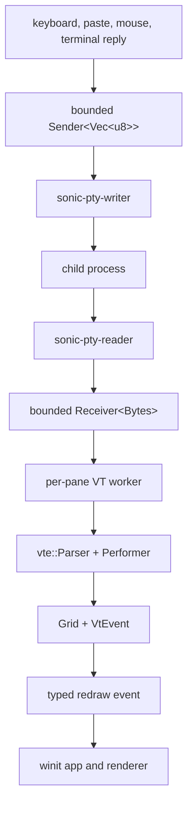
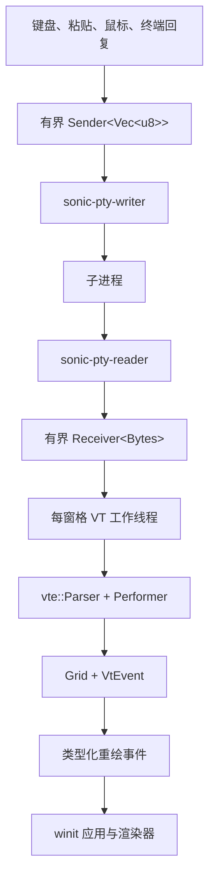

# Terminal IO and VT / 终端 IO 与 VT

## English

SonicTerm’s terminal core moves bytes between a child process and a bounded
cell grid. This page owns the local PTY (pseudo-terminal) lifecycle, VT
terminal-control protocols, grid rules, and terminal input routing. Rendering is covered by
[Rendering and Fonts](Rendering-and-Fonts) and [Rendering Modes](Rendering-Modes);
resource totals are in [Memory](Memory).

### Scope

The local PTY, parser, grid, keyboard, paste, mouse-tracking, selection, and copy
paths are cross-platform application behavior. The optional SSH transport exists
behind the `sonicterm-io/ssh` feature, but no shipping GUI call site connects an
`SshHandle`. `sonicterm-mux` is a standalone workspace binary that is not used
by the GUI and is not packaged.

### Byte and thread flow



The reader splits a reusable 64 KiB `BytesMut` ring into reference-counted
`bytes::Bytes` views. The output channel holds at most 64 chunks. A full channel
blocks the reader and lets the OS PTY apply backpressure; it does not grow.
Queued views can pin at most 64 distinct rings, or 4 MiB, although measured
shell workloads pin one 64 KiB ring.

Terminal input is non-blocking. Its channel holds four `Vec<u8>` messages, each
at most 16 MiB. Oversize, full-queue, and disconnected-writer failures return a
typed `PtyInputError` that retains the rejected bytes for retry or a visible
notification. Parser replies use the same bounded sender and never write while
a parser or grid lock is held.

The VT worker coalesces output before requesting a frame. A quiet interval of
3 ms flushes a trailing batch; a batch also flushes after 128 KiB or 8 ms. Every
pane constructor uses the same host-event processor. Parser advancement and mode
snapshots run under the pane's parser lock; clipboard and command dispatch,
inline-media decode or resize, and retained-store updates run after that lock is
released. The worker copies the current `WindowId` under a short guard, releases
the guard, and posts `UserEvent::RequestRedraw`. Worker threads do not call
AppKit, Win32, or winit window methods.

### Local PTY contract

`PtyHandle` owns the child, PTY master, reader and writer threads, bounded
channels, selected shell path, and a resize callback. The callback packs
`(cols, rows)` into one atomic value and suppresses identical requests, avoiding
unnecessary SIGWINCH or ConPTY reflow.

If `[terminal].shell` is absent:

- Windows tries PowerShell 7 (`pwsh.exe`, including registered and Microsoft
  Store installations), Windows PowerShell, then `cmd.exe`.
- Unix uses an executable `$SHELL`, then the current user’s executable passwd
  shell, then `/bin/sh`.
- Normal macOS launches zsh/tcsh/csh with `-l` and bash/fish with `--login`.
  Clean end-to-end mode instead suppresses profiles and banners.

The child starts in an explicit valid working directory when supplied,
otherwise in `HOME` when available. SonicTerm sets:

```text
TERM=xterm-256color
COLORTERM=truecolor
TERM_PROGRAM=<configured term_program>
TERM_PROGRAM_VERSION=<matching terminal version>
```

For `TERM_PROGRAM=SonicTerm`, the version is the workspace package version. For
`TERM_PROGRAM=WezTerm`, SonicTerm advertises `20230712-072601`, the fixed
capability-compatible WezTerm version.

Dropping `PtyHandle` cancels native IO, terminates the child, closes the PTY,
and attempts bounded reaping. Reader and writer shutdown and child reaping use
a 500 ms deadline. Unix kills the child session and rechecks descendants before
reaping the leader, so a reused process or session id is not signalled. Windows
drains a cloned ConPTY reader while closing the master, with a 2 s close
deadline. Timeout and cleanup failures are logged; teardown does not wait
forever.

### VT parser and protocols

`sonicterm-vt::Parser` wraps `vte::Parser` and a SonicTerm `Performer`. The
performer owns the `Grid` and terminal attributes. In ground state, printable
ASCII runs are inserted in bulk until an escape or control byte appears.

Current protocol support includes:

- cursor movement, save/restore, insert/delete character and line, erase,
  DECSTBM, reverse index, autowrap, cursor visibility and shape;
- SGR styles, indexed and true color, underline style and color, and
  background-color erase semantics;
- primary and alternate screens, application cursor keys, bracketed paste,
  focus reporting, and kitty keyboard flag set/push/pop/query;
- OSC 0/2 titles, host-aware OSC 7 working directory, OSC 8 hyperlinks, OSC 52
  clipboard events, OSC 4/10/11/12 color queries, and OSC 133 prompt markers;
- DSR, DA, XTVERSION, palette, and kitty keyboard replies;
- iTerm2, kitty, and Sixel media events.

OSC 7 keeps the decoded path separate from its authority-bearing, host-aware
snapshot. Relative local-path authorization uses only the strict snapshot. A
raw OSC 4 collector, capped at 4 KiB, preserves palette queries that exceed
vte’s parameter count and suppresses the truncated duplicate callback. Parser-owned
sequence-family state recognizes kitty APC after any completed escape, including
C1 APC and an `ESC` / `_` split across PTY chunks. A bounded prefix probe moves
only confirmed iTerm2 `OSC 1337;File=` input out of vte’s private OSC buffer.

An escape sequence may retain at most 1 MiB. After that, the parser discards
through the sequence terminator instead of treating the payload as printable
text. Kitty APC, Sixel DCS, and iTerm2 OSC 1337 instead share one media contract:
each payload is limited to 16 MiB, and in-flight captures share a 64 MiB process
staging pool with a 4 MiB floor and 13 simultaneous captures guaranteed at that
floor. A capture that cannot reserve staging is refused and renders nothing.
Oversized, cancelled, or truncated media is not partially rendered; after
cancellation the parser continues swallowing that payload until its terminator.
Two unchanged 30 s progress samples cancel a stalled capture, so the stated
stall interval is one minute.

### Mouse tracking and selection

`MouseTracking` has one current value; modes do not form a stack:

| DEC mode | `MouseTracking` | Reports |
| --- | --- | --- |
| reset/default | `Off` | SonicTerm owns pointer gestures |
| `DECSET ?1000` | `Button` | button press and release |
| `DECSET ?1002` | `ButtonMotion` | button events and motion while a button is held |
| `DECSET ?1003` | `AnyMotion` | button events, held motion, and no-button motion |

The last `DECSET` among `?1000`, `?1002`, and `?1003` wins. `DECRST` for the
active mode sets `Off`; reset of an inactive mode is a no-op. It does not
restore an older mode. RIS also restores `Off`.

A TUI is a terminal user interface: a full-screen text application running
inside the terminal.

`DECSET ?1006` controls SGR mouse encoding independently; it does not enable
tracking. Application-owned clicks, releases, wheel input, and eligible motion
use SGR reports when `?1006` is active and the current legacy report otherwise.
SGR uses one-based `CSI < Cb ; Cx ; Cy M` and lowercase `m` for release. Legacy
uses `CSI M` plus three biased bytes and clamps the protocol coordinates to 223.
Wheel reports use button codes 64 for up and 65 for down and have no release
report.

A press chooses and latches one gesture owner:

- an unmodified press while tracking is active belongs to the TUI;
- a Shift-press belongs to SonicTerm’s local selection, even while tracking is
  active;
- a press while tracking is `Off` is local;
- a press consumed by tabs, splitters, scrollbars, or other chrome creates no
  terminal gesture.

The gesture owner, press pane, tracking mode, and SGR/legacy profile are latched
until release. Later modifier, pane-focus, mode, or `?1006` changes do not steal
the gesture. A terminal release uses the press pane/profile and the last valid
cell seen in that pane. `Button` suppresses held motion; `ButtonMotion` and
`AnyMotion` report it. With no button held, only the current `AnyMotion` mode
reports motion, using the current pane and encoding profile.

Selections are bound to their pane, a monotonic primary/alternate screen epoch,
content sequence, and scrollback-eviction baseline. Primary-screen scrolling
carries selected text into history and rebases both surviving endpoints and the
active drag anchor. A screen epoch or pane change, an evicted selected row, or a
changed row intersecting the selection clears it; unrelated row changes and
same-value repaints do not. The epoch rejects a primary-to-alternate-to-primary
ABA transition even when the restored cells match. The check runs before
rendering and immediately before copy.

For an explicit alternate-screen copy, a successful clipboard write clears the
selection. Clipboard failure preserves it so the user can retry. If content has
become stale, SonicTerm clears the selection without copying and leaves the
clipboard unchanged. Operational rmux/tmux mouse ownership and OSC 52 setup are
documented in [Usage](Usage).

### Grid storage and invariants

A `Grid` owns visible rows, bounded scrollback, cursor/default-cell state, dirty
rows, content sequence numbers, an optional boxed saved primary screen, and up
to 256 OSC 133 prompt regions in scrollback-absolute coordinates.

The exact geometry bounds are:

- at most 4,096 columns or rows on either axis;
- at most 524,288 visible cells in one primary or alternate screen;
- at most 1,048,576 cells across visible rows, history, and a saved primary
  screen;
- at most 64 UTF-8 bytes of combining/zero-width extras per cell.

The retained-byte enforcement target is
`MAX_GRID_CELLS × size_of::<Cell>()`, about 24 MiB on the current build. It is a
shared grid budget, not a second 24 MiB scrollback allowance. The configured
`[terminal].scrollback` row count can bind first. Every 512 scrolled rows, the
grid checks retained capacity; if compaction cannot bring it under the target,
it drops oldest history in 64-row blocks. Lowering the configured row limit
drops old rows immediately.

Width-two characters use a `WIDE` lead cell and `WIDE_CONT` continuation. Range
mutations expand or repair around them so half a glyph cannot remain. Combining
characters attach to the previous lead cell. `Line` stores arbitrary rows as
`Flat(Vec<Cell>)` and materially smaller repetitive rows as run-length
`Cluster(Vec<Cluster>)`; both representations iterate and hash identically.

Every content mutation advances the grid revision, marks affected rows, and
stamps changed content. Cursor-only and presentation-only changes do not advance
the content sequence. Primary full-screen scroll moves row identity into
history. Alternate-screen, zero-history, and partial-region scroll restamp the
fixed screen positions that changed.

### Unshipped transport seams

The optional `ssh` feature runs `russh` on a dedicated current-thread Tokio
runtime and exposes PTY-like input, output, and resize channels. It checks an
explicit key or `~/.ssh/id_ed25519` and `~/.ssh/id_rsa`. Host keys are accepted
without persistence or comparison; ssh-agent, password, and
keyboard-interactive authentication are absent. Because the GUI does not create
an `SshHandle`, this is not a shipping remote-session feature.

`sonicterm-mux` currently implements length-prefixed bincode messages for list,
spawn, attach, detach, input, resize, and kill. A session has a PTY, a 256 KiB
raw-byte replay ring, and a bounded subscriber queue that drops its oldest event
under backpressure. It forwards bytes without server-side VT parsing or
grid-aware scrollback. No GUI or platform crate depends on it, and release
workflows do not package it.

### Code locations

| Topic | Primary paths |
| --- | --- |
| PTY, shell, queues, teardown | `crates/sonicterm-io/src/pty.rs` |
| Optional SSH | `crates/sonicterm-io/src/ssh.rs` |
| Pane worker and redraw coalescing | `crates/sonicterm-app/src/app/spawn_pane.rs` |
| Main/child input routing | `crates/sonicterm-app/src/app/{window_event,child_window}.rs` |
| VT parser and modes | `crates/sonicterm-vt/src/vt.rs` |
| Grid and line storage | `crates/sonicterm-grid/src/{grid,line,hyperlink}.rs` |
| Selection and copy | `crates/sonicterm-ui/src/selection.rs`, `crates/sonicterm-app/src/app/misc.rs` |
| Mux protocol | `crates/sonicterm-mux/src/{proto,frame,server,main}.rs` |

## 中文

SonicTerm 的终端核心在子进程与有界单元格网格之间传递字节。本页负责本地 PTY
生命周期、VT 协议、网格规则和终端输入路由。渲染见
[渲染与字体](Rendering-and-Fonts)和[渲染模式](Rendering-Modes)，资源总量见
[内存](Memory)。

### 范围

本地 PTY、解析器、网格、键盘、粘贴、鼠标追踪、选择与复制路径属于跨平台应用行为。
可选 SSH 传输位于 `sonicterm-io/ssh` 功能之后，但发布版 GUI 没有创建 `SshHandle`
的调用点。`sonicterm-mux` 是工作区中的独立二进制，GUI 不使用，发布包也不包含。

### 字节与线程流



读取线程把可复用的 64 KiB `BytesMut` 环形缓冲拆成引用计数的 `bytes::Bytes`
视图。输出通道最多保留 64 个数据块。通道满时读取线程等待，由操作系统 PTY
施加背压，不会继续增长。排队视图最多可固定 64 个不同的环形缓冲，即 4 MiB；
实测普通 shell 工作负载只固定一个 64 KiB 环形缓冲。

终端输入不阻塞。通道最多保存四条 `Vec<u8>` 消息，每条最多 16 MiB。消息过大、
队列已满或写入端断开时，会返回带类型的 `PtyInputError`，其中仍保留被拒绝的字节，
便于重试或显示通知。解析器回复使用同一个有界发送端；持有解析器或网格锁时绝不写 PTY。

VT 工作线程会先合并输出，再请求一帧。连续 3 ms 没有新数据时刷新尾批次；批次达到
128 KiB 或等待 8 ms 也会刷新。所有窗格构造路径都使用同一个宿主事件处理器。推进解析器
和快照模式时持有该窗格的解析器锁；剪贴板与命令分发、内联媒体解码或缩放以及常驻存储更新
都在释放该锁后执行。线程在短暂加锁时复制当前 `WindowId`，释放锁后发送
`UserEvent::RequestRedraw`。工作线程不调用 AppKit、Win32 或 winit 窗口方法。

### 本地 PTY 契约

`PtyHandle` 拥有子进程、PTY 主端、读写线程、有界通道、已选 shell 路径和尺寸调整
回调。回调把 `(cols, rows)` 打包到一个原子值中，并忽略相同请求，避免多余的
SIGWINCH 或 ConPTY 重排。

未配置 `[terminal].shell` 时：

- Windows 依次尝试 PowerShell 7（`pwsh.exe`，包括注册安装和 Microsoft Store
  安装）、Windows PowerShell、`cmd.exe`。
- Unix 依次使用可执行的 `$SHELL`、当前用户 passwd 记录中的可执行 shell、`/bin/sh`。
- macOS 正常运行时，zsh/tcsh/csh 使用 `-l`，bash/fish 使用 `--login`。
  干净端到端测试模式则关闭配置文件和启动横幅。

若提供了有效的显式工作目录，子进程从该目录启动；否则在可用时使用 `HOME`。
SonicTerm 设置：

```text
TERM=xterm-256color
COLORTERM=truecolor
TERM_PROGRAM=<配置的 term_program>
TERM_PROGRAM_VERSION=<与终端身份匹配的版本>
```

`TERM_PROGRAM=SonicTerm` 时使用工作区包版本。`TERM_PROGRAM=WezTerm` 时固定报告
与已实现能力匹配的 WezTerm 版本 `20230712-072601`。

释放 `PtyHandle` 时会取消原生 IO、终止子进程、关闭 PTY，并限时回收进程。读写线程
退出和子进程回收的期限是 500 ms。Unix 会终止子进程会话，并在回收主进程前重新
核对后代，避免向已复用的进程号或会话号发信号。Windows 在关闭 ConPTY 主端时并行
排空一个克隆读取端，关闭期限为 2 s。超时和清理失败会写日志，析构不会无限等待。

### VT 解析器与协议

`sonicterm-vt::Parser` 包装 `vte::Parser` 与 SonicTerm `Performer`。`Performer`
拥有 `Grid` 和终端属性。状态机处于基态时，会批量插入可打印 ASCII，
直到遇到转义或控制字节。

当前协议支持：

- 光标移动、保存/恢复、插入/删除字符与行、擦除、DECSTBM、反向索引、自动换行、
  光标可见性和形状；
- SGR 样式、索引色、真彩色、下划线样式与颜色，以及按背景色擦除；
- 主屏幕与备用屏幕、应用光标键、括号粘贴、焦点报告，以及 kitty 键盘标志的
  set/push/pop/query；
- OSC 0/2 标题、带主机校验的 OSC 7 工作目录、OSC 8 超链接、OSC 52 剪贴板事件、
  OSC 4/10/11/12 颜色查询、OSC 133 提示符标记；
- DSR、DA、XTVERSION、调色板和 kitty 键盘回复；
- iTerm2、kitty 与 Sixel 媒体事件。

OSC 7 分开保存解码路径和带权限含义的主机校验快照。相对本地路径授权只使用严格
快照。原始 OSC 4 收集器上限为 4 KiB，用于保留超过 vte 参数数量上限的调色板查询，
并抑制被截断的重复回调。解析器自身维护序列族边界，因此 kitty APC 可紧跟任何已完成
转义序列，并同时支持 C1 APC 与跨 PTY 数据块拆分的 `ESC` / `_`。有界前缀探测只会把
已确认的 iTerm2 `OSC 1337;File=` 输入从 vte 的私有 OSC 缓冲中接管出来。

单条普通转义序列最多保留 1 MiB；超过后，解析器会一直丢弃到序列终止符，不会把负载
当作可打印文本。Kitty APC、Sixel DCS 与 iTerm2 OSC 1337 改用同一个媒体契约：单个负载
上限为 16 MiB；传输中的捕获共用进程级 64 MiB 暂存池，每个捕获下限为 4 MiB，可保证
13 个并发捕获都获得该下限。无法预留暂存空间时会拒绝整个捕获，不显示任何内容。超大、
已取消或截断的媒体都不会局部显示；取消后，解析器仍会吞掉该负载直到终止符。连续两次
30 s 采样都没有进度时取消捕获，因此声明的停滞时间是一分钟。

### 鼠标跟踪与选区

`MouseTracking` 只有一个当前值；各模式不会形成栈：

| DEC 模式 | `MouseTracking` | 报告内容 |
| --- | --- | --- |
| 重置/默认 | `Off` | 指针手势由 SonicTerm 处理 |
| `DECSET ?1000` | `Button` | 按下与释放 |
| `DECSET ?1002` | `ButtonMotion` | 按键事件以及按住按键时的移动 |
| `DECSET ?1003` | `AnyMotion` | 按键事件、按住时移动和无按键移动 |

`?1000`、`?1002`、`?1003` 中最后一次 `DECSET` 生效。对当前模式执行 `DECRST`
会切换为 `Off`；重置非当前模式不做任何事，也不会恢复更早的模式。RIS 同样恢复
`Off`。

TUI 指在终端内运行的全屏文本界面程序。

`DECSET ?1006` 只控制 SGR 鼠标编码，与是否启用跟踪相互独立。`?1006` 生效时，
应用拥有的点击、释放、滚轮和符合条件的移动使用 SGR 报告，否则使用当前旧式报告。
SGR 使用从 1 开始的 `CSI < Cb ; Cx ; Cy M`，释放使用小写 `m`。旧式格式使用
`CSI M` 加三个偏移字节，并把协议坐标限制在 223。滚轮向上、向下分别使用按键码
64、65，不发送释放报告。

按下时只选择并锁定一个手势所有者：

- 跟踪启用时，无修饰键按下交给 TUI；
- 即使跟踪启用，按住 Shift 开始的手势仍由 SonicTerm 本地选区处理；
- 跟踪为 `Off` 时，手势由本地处理；
- 标签栏、分隔条、滚动条或其它界面先消费按下事件时，不创建终端手势。

手势所有者、按下时的窗格、跟踪模式和 SGR/旧式编码配置会一直锁定到释放。之后的
修饰键、窗格焦点、模式或 `?1006` 变化都不能夺走手势。终端释放报告使用按下时的
窗格和编码配置，以及该窗格内最后一个有效单元格。`Button` 不报告按住移动；
`ButtonMotion` 与 `AnyMotion` 会报告。没有按键按下时，只有当前 `AnyMotion` 会
报告移动，并使用当前窗格与当前编码配置。

选区会绑定所属窗格、单调递增的主/备用屏幕 epoch、内容序列和回滚淘汰基线。
主屏幕滚动会让选中文本进入历史，并重新定位仍存活的端点与当前 drag anchor。
屏幕 epoch 或窗格变化、淘汰已选行，或修改与选区相交的行都会清除选区；无关行变化
与同值重绘不会。即使恢复后的 cell 相同，epoch 也会拒绝“主屏幕→备用屏幕→主屏幕”
的 ABA 切换。渲染前和复制前都会执行检查。

显式复制备用屏幕选区时，剪贴板写入成功后清除选区；写入失败则保留，便于重试。
若所选内容已经过期，SonicTerm 会清除选区但不复制，剪贴板保持不变。rmux/tmux 的
mouse ownership 与 OSC 52 实际配置见 [用法](Usage)。

### 网格存储与不变量

`Grid` 拥有可见行、有界回滚、光标与默认单元格状态、脏行、内容序列号、可选的盒装
已保存主屏幕，以及最多 256 个使用回滚绝对坐标的 OSC 133 提示符区域。

精确几何上限为：

- 任一轴最多 4,096 列或行；
- 单个主屏幕或备用屏幕最多 524,288 个可见单元格；
- 可见行、历史和已保存主屏幕合计最多 1,048,576 个单元格；
- 每个单元格最多保存 64 个 UTF-8 字节的组合字符或零宽附加内容。

保留字节的执行目标是 `MAX_GRID_CELLS × size_of::<Cell>()`，当前构建约为 24 MiB。
这是共享网格预算，不是额外再给回滚 24 MiB。配置的 `[terminal].scrollback` 行数
可能先达到上限。每滚动 512 行检查一次保留容量；若压缩仍不能降到目标内，则以每批
64 行删除最老历史。降低配置行数时会立即删除旧行。

双宽字符使用带 `WIDE` 的首单元格和带 `WIDE_CONT` 的续单元格。范围修改会围绕它们
扩展或修复，不能留下半个字形。组合字符附着到前一个首单元格。`Line` 用
`Flat(Vec<Cell>)` 保存任意行，用显著更小的游程 `Cluster(Vec<Cluster>)` 保存重复行；
两种表示的迭代和哈希结果相同。

每次内容修改都会推进网格修订计数、标记受影响行并记录内容序列。仅移动光标或改变
呈现状态不会推进内容序列。主屏幕全屏滚动会让行身份随文本进入历史；备用屏幕、无历史
和局部区域滚动则为发生变化的固定屏幕位置重新记录序列。

### 未发布的传输接缝

可选 `ssh` 功能在专用单线程 Tokio 运行时上运行 `russh`，并提供类似 PTY 的输入、
输出和尺寸调整通道。它检查显式密钥或 `~/.ssh/id_ed25519`、`~/.ssh/id_rsa`。
主机密钥会被直接接受，不保存也不在后续连接中比较；没有 ssh-agent、密码或键盘交互
认证。GUI 不创建 `SshHandle`，因此这不是已发布的远程会话功能。

`sonicterm-mux` 当前使用带长度前缀的 bincode 消息，支持 `list`、`spawn`、`attach`、
`detach`、`input`、`resize`、`kill`。每个会话拥有一个 PTY、256 KiB 原始字节回放环和有界
订阅队列；发生背压时队列丢弃最早事件。它只转发字节，不在服务端解析 VT，也不提供
网格感知回滚。GUI 和平台 crate 都不依赖它，发布流程也不打包。

### 代码位置

| 主题 | 主要路径 |
| --- | --- |
| PTY、shell、队列、析构 | `crates/sonicterm-io/src/pty.rs` |
| 可选 SSH | `crates/sonicterm-io/src/ssh.rs` |
| 窗格工作线程与重绘合并 | `crates/sonicterm-app/src/app/spawn_pane.rs` |
| 主窗口/子窗口输入路由 | `crates/sonicterm-app/src/app/{window_event,child_window}.rs` |
| VT 解析器与模式 | `crates/sonicterm-vt/src/vt.rs` |
| 网格与行存储 | `crates/sonicterm-grid/src/{grid,line,hyperlink}.rs` |
| 选区与复制 | `crates/sonicterm-ui/src/selection.rs`、`crates/sonicterm-app/src/app/misc.rs` |
| Mux 协议 | `crates/sonicterm-mux/src/{proto,frame,server,main}.rs` |
