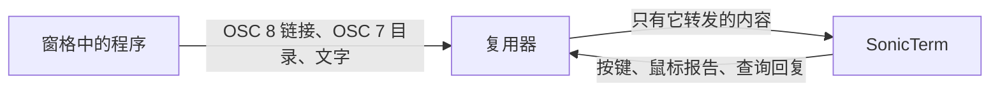

# 终端复用器

[English](Terminal-Multiplexers)

SonicTerm 像运行其它程序一样运行 tmux、rmux、GNU screen、Zellij 和 Byobu。哪些终端
功能能到达 SonicTerm，由复用器决定：链接、工作目录、颜色、按键、剪贴板写入和鼠标报告。
本页列出各复用器会转发什么、让 tmux 与 rmux 转发其余功能的设置，以及链接和路径在窗格中
的行为。



## 转发内容

下列复用器都在 macOS 上的伪终端中运行，该伪终端按 SonicTerm 1.3.7 的方式回答其身份
查询。tmux 与 rmux 使用 `osc7` 和 `set-titles on`，并分别测试有无 `hyperlinks`。

| 复用器 | OSC 8 链接 | OSC 7 工作目录 | 全宽窗格中的长行 |
| --- | --- | --- | --- |
| tmux 3.7c | 仅在启用 `hyperlinks` 时转发；链接 id 换成 tmux 自己的 id | 仅活动窗格 | 由 SonicTerm 换行 |
| rmux 0.10.0 | 始终转发；保留程序给出的链接 id | 仅活动窗格 | 每行单独放置 |
| GNU screen 4.00.03 与 5.0.2 | 从不转发 | 从不转发 | 由 SonicTerm 换行 |
| Zellij 0.45.1 | 始终转发，并把识别出的纯文本 URL 变成链接 | 从不转发 | 每行单独放置 |

在分屏窗格中，tmux 与 rmux 同样逐行单独放置。SonicTerm 自己换行时会记录换行位置，
因此能跨换行连接 URL 或路径。复用器用光标移动放置的一行，无论是接续上一行还是开始
新行，看起来都一样，因此 SonicTerm 无法跨它连接。下文说明这对链接和路径的影响。

## tmux 与 rmux 推荐配置

tmux 与 rmux 读取相同的设置，因此 Windows、macOS 和 Linux 上的两者可共用一段配置。
除非有明确需求，否则保留默认按键和鼠标绑定；剪贴板策略见“鼠标与剪贴板”。

| 复用器与主机 | 建议的用户配置文件 |
| --- | --- |
| tmux | `~/.tmux.conf` 或 `$XDG_CONFIG_HOME/tmux/tmux.conf` |
| Windows 上的 rmux | `%USERPROFILE%\.rmux.conf` |
| macOS 上的 rmux | `~/.rmux.conf` |
| Linux 上的 rmux | `~/.config/rmux/rmux.conf` |

rmux 的这些路径受支持，但不是完整的搜索顺序；其它已有 rmux 配置或 tmux 配置后备也
可能提供设置。启动新服务时可用 `rmux -f <path>` 明确指定文件；改动文件不会重新配置
正在运行的服务。

```tmux
set -g default-terminal "tmux-256color"
set -as terminal-features ",xterm-256color:RGB:extkeys:osc7:hyperlinks:usstyle"
set -g set-titles on
set -g mouse on
set -s extended-keys on
set -s extended-keys-format csi-u
set -s set-clipboard external
set -s copy-command ''
```

| 能力 | 为 SonicTerm 带来的效果 |
| --- | --- |
| `hyperlinks` | tmux 转发 OSC 8 链接，SonicTerm 才能为其添加下划线、预览并打开。rmux 不需要此项也会转发。 |
| `osc7` | 配合 `set-titles on`，复用器发送活动窗格的工作目录，相对路径才能解析。缺少任一项都不会发送目录。 |
| `RGB` | 24 位颜色。 |
| `extkeys` | tmux 通过 `modifyOtherKeys` 向 SonicTerm 请求扩展按键，Shift+Enter 等按键才能到达请求它们的程序。rmux 不需要此项也会请求。 |
| `usstyle` | 波浪线、点线、虚线下划线及下划线颜色，编辑器用它们显示诊断。rmux 不需要此项也会转发。 |

以下能力不要添加：

- `margins` 与 `rectfill`：SonicTerm 未实现 DECSLRM 与 DECFRA，复用器若用它们滚动
  或清除分屏窗格，画面会出错。
- `overline` 与 `progressbar`：SonicTerm 不绘制上划线，也忽略 OSC 9;4 进度，因此
  它们没有作用。
- `sync`：SonicTerm 接受同步输出，但仍立即绘制，因此没有变化。

SonicTerm 向其启动的程序提供 `TERM=xterm-256color` 与 `COLORTERM=truecolor`。让复用器
在窗格内报告 `tmux-256color`；不要在 shell profile 中覆盖 `TERM`，也不要为了开启功能而
冒充其它终端。Unix 主机可用 `infocmp tmux-256color` 检查程序能否找到对应 terminfo；
若缺失，应安装匹配的 terminfo，而不是修改外层终端身份。

`xterm-256color` 能力项描述的是 SonicTerm，不是内层窗格。tmux 用它匹配每个连接的
client 的 `TERM`，因此以相同 `TERM` 连接的所有终端都会得到同样的能力；只添加它们都
支持的能力。

### 检查结果

tmux 与 rmux 在 client 连接时解析其能力。修改 `terminal-features` 后，用
`tmux source-file ~/.tmux.conf` 或 `rmux source-file <path-to-config>` 重新加载配置，
detach 后重新 attach，然后在窗格中运行：

```sh
tmux display -p '#{client_termfeatures}'
printf '\033]8;;https://example.com/\033\\example link\033]8;;\033\\\n'
```

能力列表应包含 `hyperlinks` 与 `osc7`；rmux 请改用
`rmux list-clients -F '#{client_termfeatures}'`。在 macOS 上按住 Cmd、在 Windows 与
Linux 上按住 Ctrl 指向 `example link`：SonicTerm 会为它添加下划线并显示
`https://example.com/`。对于 rmux，还应检查实际服务器选项：

```sh
rmux show-options -g default-terminal
rmux show-options -g mouse
rmux show-options -s extended-keys
rmux show-options -s extended-keys-format
rmux show-options -s set-clipboard
rmux show-options -s copy-command
```

若使用命名服务，请在每条命令中加入 `-L <name>`。已有窗格进程保留原环境，因此修改
`default-terminal` 后应在新窗格中检查。验证 Shift+Enter 与 Enter、CJK 文本选择/复制、
目标 TUI 内滚轮行为，不要只依赖选项读回。这些结果按 tmux 3.7c 与 RMUX 0.10.0 核对，
不表示每个版本或每种主机的行为都相同。

## 窗格中的链接与路径

在 macOS 上按住 Cmd、在 Windows 与 Linux 上按住 Ctrl 指向链接或路径；可打开的目标会
显示下划线，随后可以点击。[用法](Usage-zh-CN)中的“打开 URL 与本地目标”说明目标的一般
规则；本节说明复用器中的不同之处。

### OSC 8 链接

程序可以打印标签与目标不同的链接，例如 Claude Code 显示的 Markdown 链接。只有复用器
转发该链接时，SonicTerm 才会为目标添加下划线并显示预览。未启用 `hyperlinks` 的 tmux 与
GNU screen 只转发标签，因此 `#54` 这样的链接没有下划线，也没有预览；自行处理鼠标点击的
程序仍可能打开它。

复用器逐行重绘跨行的链接，因此没有任何一行记录换行。在备用屏幕上，若一个片段结束于
所在窗格的右边缘，而下一行同一链接的片段从同一窗格的左边缘开始，SonicTerm 会让下划线
跨行延续。窗格边缘是网格边缘，或两行在同一列绘制的竖直框线字符（细线、粗线或双线），
例如 tmux 的默认窗格边框。用 ASCII 字符绘制的边框（如 tmux 的 `simple` 与 `number`
样式）不会被识别。最多为八个片段添加下划线；点击任意片段都会打开存储的目标。

### 纯文本 URL 与路径

SonicTerm 直接在窗格文字中查找纯文本 URL 与路径，因此它们适用于所有复用器，包括
GNU screen。除[用法](Usage-zh-CN)中所述、只在全宽窗格中连接的括号内 URL 外，只有在已记录换行的位置，
SonicTerm 才会跨行连接 URL 或路径。在备用屏幕上，SonicTerm 只在指针所在的窗格中查找纯文本
URL 或路径，因此窗格边框与网格边缘一样会结束它。复用器放置的一行与新行看起来相同，
因此若纯文本 URL 或路径所在的文字（到最近的空格为止）到达所在窗格的右边缘，或从窗格
左边缘开始且上一行填满了窗格，SonicTerm 不会为它添加链接：真正的目标可能在另一行继续，
打开截断的前缀会打开错误的位置。文件名可以包含空格，因此路径旁的词语到达边缘时同样
如此：它们可能与路径一起构成更长的文件名。此规则适用于备用屏幕上的所有程序，因此恰好
结束于边缘的完整 URL 或路径同样不会添加链接。长 URL 请加宽窗格，或使用输出 OSC 8 链接
的程序。Zellij 会把它识别出的纯文本 URL 变成带完整目标的 OSC 8 链接，因此这类 URL 在
Zellij 中仍可使用。在主屏幕上，程序按顺序写入各行，因此到达网格边缘但没有记录换行的
一行确实是行尾。

### 工作目录

相对路径和 bare name 针对窗格最近一次通过 OSC 7 报告的目录解析。每个窗格内的 shell
必须在工作目录变化时发出 OSC 7。tmux 与 rmux 会记录该报告；启用 `osc7` 和
`set-titles on` 后，它们会把活动窗格的目录发给 SonicTerm，并在另一个窗格变为活动窗格时
再次发送。`#{pane_current_path}` 是复用器 format 使用的进程检查元数据；shell 没有报告时，
它不会代替 OSC 7。

SonicTerm 为每个 SonicTerm 窗格保存一个目录，而整个复用器窗口运行在一个窗格中，因此
非活动复用器窗格中显示的相对路径会针对活动窗格的目录解析。请先点击该窗格使其成为活动
窗格。GNU screen 与 Zellij 不发送目录，因此 SonicTerm 保留复用器启动前 shell 报告的目录；
其中的相对路径可能针对错误的文件夹解析，请优先使用绝对路径和 `~/` 路径。

同一报告也让主窗口和子窗口中的普通新标签页与分屏继承窗格的目录。继承只接受空主机、
`localhost` 或准确本机主机名，以及解码后 UTF-8 不超过 4,096 字节的原生绝对路径。显式
目录优先，新窗口不继承。OSC 7 缺失、格式错误或声明远端主机时，SonicTerm 仍会 fail
closed：它不会从进程目录、复用器状态元数据、其它窗格或命名用户的 home 猜测目录。绝对
路径不依赖 OSC 7。

## 标题与 shell 集成

前台为 `rmux`、`tmux` 或 `screen` 时，即使已知目录，也优先显示非空原始 OSC 标题；手动
标题仍优先。其它进程保持普通的目录优先自动标题。OSC 8 保留 URI 分号；OSC 133 `B` 结束
提示符但不计时，`C` 开始执行，`A`/`D` 保持区域行为。这是有限范围的 shell 集成，不表示
完整 WezTerm 对等能力。

## 键盘

推荐配置使用 `extended-keys on`，不是 `always`；内层应用还需请求扩展按键报告。`csi-u`
选择的是复用器发给该应用的编码，不是 SonicTerm 的全局编码。Windows 上 RMUX 读取原生
控制台输入，SonicTerm 遵循 ConPTY 的 Win32 输入请求；macOS 和 Linux 上 tmux 与 RMUX
通过 `modifyOtherKeys` 向 SonicTerm 请求扩展输入，其中 tmux 只在启用 `extkeys` 能力时
请求。SonicTerm 中协商后的非零 Kitty flags 仍具有更高优先级。不要为了修饰键问题而全局
强制启用 Windows 控制台 VT 输入。外层协议规则见[终端 IO 与 VT](Terminal-IO-and-VT-zh-CN)。

## 鼠标与剪贴板

外层终端、复用器和内层 TUI 是三个独立的输入与剪贴板层。第一次按下鼠标时取得所有权
的层，会一直持有完整 gesture 直到松开：

| Gesture 或复制路径 | 所有者 | 结果 |
| --- | --- | --- |
| 内层程序请求 mouse tracking 时的无修饰键 drag | 通过复用器交给内层程序 | 程序选区与程序控制的边缘滚动 |
| 内层未请求 mouse tracking 且复用器 mouse mode 已开启时的无修饰键 drag | 复用器 | copy-mode 选区 |
| mouse-down 前已按住 `Shift` | SonicTerm | 对当前已绘制 cell 建立本地终端选区 |
| 按住 `Cmd` 或 `Ctrl` 点击带下划线的链接或路径 | SonicTerm | 打开 URL 或目录，或在所在文件夹中选中文件 |
| 复用器 copy 命令 | 复用器 | 复用器 buffer 加已配置的系统/OSC 52 复制 |
| 内层程序发出 OSC 52 write | 内层程序，由复用器转发 | SonicTerm 写入原生剪贴板 |

保留标准条件式窗格绑定，不要强制所有 drag 都进入 copy mode：

```tmux
set -g mouse on
bind -n MouseDown1Pane { select-pane -t=; send -M }
bind -n MouseDrag1Pane { if -F '#{||:#{pane_in_mode},#{mouse_any_flag}}' { send -M } { copy-mode -M } }
```

这些绑定先选择窗格；内层 TUI 请求鼠标报告时转发，否则进入复制模式。只有内层 TUI 能在
边缘拖动时显示更多虚拟会话记录。无条件把 `MouseDrag1Pane` 绑定为 `copy-mode -M` 会让
复用器接管滚轮与拖动，并可能滚入应用 live alternate screen 外的历史。

**剪贴板推荐：** 保留 `set-clipboard external` 与空 `copy-command`，让复用器自己发起的
复制通过 OSC 52 到达 SonicTerm。这样不需要本机剪贴板工具；只要每层外部终端支持转发，
SSH 也可使用。`external` 会忽略窗格内程序发出的剪贴板写入。若信任这些程序，并希望它们
自己的复制操作到达 SonicTerm，可选择：

```tmux
set -s set-clipboard on
```

这个选项允许窗格输出替换你的剪贴板，但不表示默认还需 `allow-passthrough on`；允许原始
转义直通是另一项独立的信任决定。

对于**本机复制模式的管道动作**，可选用与复用器所在主机相符的命令替换空
`copy-command`：

| 主机/会话 | 所需可执行程序 | `copy-command` 值 |
| --- | --- | --- |
| Windows | Windows PowerShell | 使用下方显式 UTF-8 命令 |
| macOS | `pbcopy` | `'pbcopy'` |
| Linux Wayland | wl-clipboard 提供的 `wl-copy` | `'wl-copy'` |
| Linux X11 | `xclip` | `'xclip -selection clipboard'` |

```tmux
# Windows：先将 RMUX 的原始 UTF-8 stdin 解码，再写入剪贴板。
set -s copy-command 'powershell -NoProfile -NonInteractive -Command "[Console]::InputEncoding=[Text.Encoding]::UTF8; Set-Clipboard -Value ([Console]::In.ReadToEnd())"'
# macOS：选择此项而不是上方 Windows 命令。
# set -s copy-command 'pbcopy'
# Linux Wayland：需要 wl-copy 及当前 compositor 的访问权限。
# set -s copy-command 'wl-copy'
# Linux X11：需要 xclip 及当前 DISPLAY 的访问权限。
# set -s copy-command 'xclip -selection clipboard'
```

管道命令运行在复用器所在主机上，因此远端的 `pbcopy` 或 `wl-copy` 并不自动写入连接端
机器的剪贴板。SSH/无图形界面会话优先采用 OSC 52。Windows 上 `clip.exe` 或裸
`$input | Set-Clipboard` 可能通过控制台代码页解码 UTF-8，破坏框线字符、CJK、重音字符
和 emoji。

`copy-command` 用于没有显式命令的 `copy-pipe*` 动作；普通 `copy-selection` 不执行它。
OSC 52 与管道命令是独立效果，配置命令不会关闭 OSC 52。如果明确只需要本机命令，另设
`set-clipboard off`，这会关闭该剪贴板转发。所有管道命令配置都必须可信。

排查方法：

- 若高亮只在按住鼠标时出现、松开即消失，先确认 press 归哪一层；支持鼠标的内层 TUI
  可能正在绘制自己的临时选区。
- 若 copy mode 滚出内层 TUI，请恢复条件式 `MouseDrag1Pane` 绑定，让内层程序持有 mouse
  tracking 与边缘滚动。
- 若可以选择但原生剪贴板不变，请用 `set-clipboard on` 开启可信 OSC 52 relay；若复制由
  复用器持有，则配置 UTF-8 `copy-command`。
- mouse-down 前按住 `Shift` 可使用 SonicTerm 本地选区后备。它只能看到已绘制 cell，
  因此不能驱动内层程序的虚拟滚动。

协议边界见[终端 IO 与 VT](Terminal-IO-and-VT-zh-CN)，UTF-8 与剪贴板策略契约见
[RMUX 剪贴板指南](https://github.com/Helvesec/rmux/blob/dfd68c774ca0f4212139a21d37d09c90f75f8bd7/docs/human-friendly-config.md#copying-text)。

## 其它复用器

**GNU screen** 在 4.00.03 与 5.0.2 中都既不转发 OSC 8 链接，也不转发 OSC 7 目录。
SonicTerm 仍会在其输出中查找纯文本 URL 与路径并连接长行，因为 screen 让 SonicTerm 自己
换行。相对路径针对 screen 启动前 shell 报告的目录解析。

**Zellij** 转发 OSC 8 链接，并把它识别出的纯文本 URL 变成链接，但不发送工作目录。在其中
请使用绝对路径或 `~/` 路径。

**Byobu** 运行 tmux 或 GNU screen；按它所用的复用器对应的部分设置。
