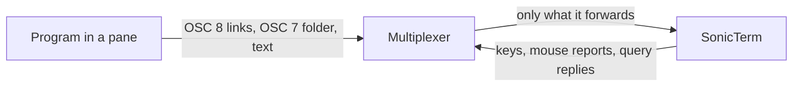

# Terminal Multiplexers

[简体中文](Terminal-Multiplexers-zh-CN)

SonicTerm runs tmux, rmux, GNU screen, Zellij and Byobu like any other program.
The multiplexer decides which terminal features reach SonicTerm: links, the
working directory, colors, keys, clipboard writes and mouse reports. This page
lists what each one passes through, the settings that make tmux and rmux pass
the rest, and how links and paths behave inside panes.



## What passes through

Each multiplexer ran on macOS in a pseudo-terminal that answered its identity
queries as SonicTerm 1.3.7 does. tmux and rmux used `osc7` and `set-titles on`,
with and without `hyperlinks`.

| Multiplexer | OSC 8 links | OSC 7 working directory | Long lines in a full-width pane |
| --- | --- | --- | --- |
| tmux 3.7c | Only with `hyperlinks`; link ids become tmux's own | Active pane only | Wrapped by SonicTerm |
| rmux 0.10.0 | Always; program link ids are kept | Active pane only | Each row placed separately |
| GNU screen 4.00.03 and 5.0.2 | Never | Never | Wrapped by SonicTerm |
| Zellij 0.45.1 | Always, and plain URLs it detects become links | Never | Each row placed separately |

In a split pane, tmux and rmux also place each row separately. When SonicTerm
wraps a long line itself, it records the wrap and can join a URL or path across
it. A row that the multiplexer places with a cursor move looks the same whether
it continues the previous row or starts a new line, so SonicTerm cannot join
across it. The sections below describe what that means for links and paths.

## Recommended settings for tmux and rmux

tmux and rmux read the same settings, so one block serves both on Windows,
macOS and Linux. Keep the default key and mouse bindings unless you have a
specific reason to replace them, and choose a clipboard policy under Mouse and
clipboard.

| Multiplexer and host | Suggested user config file |
| --- | --- |
| tmux | `~/.tmux.conf` or `$XDG_CONFIG_HOME/tmux/tmux.conf` |
| rmux on Windows | `%USERPROFILE%\.rmux.conf` |
| rmux on macOS | `~/.rmux.conf` |
| rmux on Linux | `~/.config/rmux/rmux.conf` |

The rmux paths are supported locations, not the complete search order; an
existing rmux config or tmux-config fallback may also supply settings. Use
`rmux -f <path>` when starting a new server to select a file explicitly;
editing a file does not reconfigure a running server.

```tmux
set -g default-terminal "tmux-256color"
set -as terminal-features ",xterm-256color:RGB:extkeys:osc7:hyperlinks:usstyle"
set -g set-titles on
set -g mouse on
set -s extended-keys on
set -s extended-keys-format csi-u
set -s set-clipboard external
set -s copy-command ''
```

| Feature | What it gives SonicTerm |
| --- | --- |
| `hyperlinks` | tmux forwards OSC 8 links, so SonicTerm can underline, preview and open them. rmux forwards them without it. |
| `osc7` | With `set-titles on`, the multiplexer sends the active pane's working directory, so relative paths resolve. Without either one, no directory is sent. |
| `RGB` | 24-bit color. |
| `extkeys` | tmux requests `modifyOtherKeys` from SonicTerm, so keys such as Shift+Enter reach programs that ask for them. rmux requests it without this feature. |
| `usstyle` | Curly, dotted and dashed underlines and underline colors, which editors use for diagnostics. rmux forwards them without it. |

Leave these features out:

- `margins` and `rectfill`: SonicTerm does not implement DECSLRM or DECFRA, so
  a multiplexer that uses them to scroll or clear a split pane would draw it
  wrongly.
- `overline` and `progressbar`: SonicTerm draws no overline and ignores OSC 9;4
  progress, so they do nothing.
- `sync`: SonicTerm accepts synchronized output but still paints immediately, so
  it changes nothing.

SonicTerm supplies `TERM=xterm-256color` and `COLORTERM=truecolor` to the
programs it starts. Let the multiplexer report `tmux-256color` inside panes; do
not overwrite `TERM` in shell profiles or spoof another terminal to enable a
feature. On Unix hosts, `infocmp tmux-256color` checks whether programs can find
that terminfo entry; install the matching entry if it is missing, rather than
changing the outer terminal identity.

The `xterm-256color` entry describes SonicTerm, not the inner pane. tmux matches
it against the `TERM` of each attaching client, so every terminal that attaches
with that `TERM` gets the same features; add only features that all of them
support.

### Check the result

tmux and rmux resolve a client's features when it attaches. After changing
`terminal-features`, reload the config with `tmux source-file ~/.tmux.conf` or
`rmux source-file <path-to-config>`, detach and reattach, and then run in a
pane:

```sh
tmux display -p '#{client_termfeatures}'
printf '\033]8;;https://example.com/\033\\example link\033]8;;\033\\\n'
```

The feature list includes `hyperlinks` and `osc7`; with rmux, run
`rmux list-clients -F '#{client_termfeatures}'` instead. Hold Cmd on macOS or
Ctrl on Windows and Linux over `example link`: SonicTerm underlines it and shows
`https://example.com/`. For rmux, also inspect the effective server options:

```sh
rmux show-options -g default-terminal
rmux show-options -g mouse
rmux show-options -s extended-keys
rmux show-options -s extended-keys-format
rmux show-options -s set-clipboard
rmux show-options -s copy-command
```

For a named server, add `-L <name>` to each command. Existing pane processes
keep their environment, so check new panes after changing `default-terminal`.
Verify Shift+Enter versus Enter, selection and copy with CJK text, and wheel
movement inside the target TUI rather than relying on option readback alone.
These results were checked against tmux 3.7c and RMUX 0.10.0; they are not a
claim of identical behavior across every release or host.

## Links and paths in panes

Hold Cmd on macOS or Ctrl on Windows and Linux while pointing at a link or path;
an eligible target becomes underlined and can be clicked. Open URLs and local
targets in [Usage](Usage) covers targets in general; this section covers what
changes inside a multiplexer.

### OSC 8 links

A program can print a link whose label differs from its destination, as Claude
Code does for Markdown links. SonicTerm underlines and previews the destination
only when the multiplexer forwards the link. tmux without `hyperlinks` and GNU
screen forward only the label, so a link such as `#54` shows no underline and no
preview. A program that handles its own mouse clicks may still open it.

A multiplexer redraws a link that spans rows one row at a time, so no row
records a wrap. On the alternate screen, SonicTerm continues the underline from
a fragment that ends at its pane's right edge to a fragment of the same link
that starts at the same pane's left edge on the next row. A pane edge is the
grid's edge, or a vertical box-drawing line (light, heavy or double) drawn in
the same column of both rows, such as tmux's default pane border. Borders drawn
with ASCII characters, such as tmux's `simple` and `number` styles, are not
recognized. At most eight fragments are underlined; clicking any fragment opens
the stored destination.

### Plain URLs and paths

SonicTerm finds plain URLs and paths in the pane's text, so they work with every
multiplexer, including GNU screen. Apart from the bracketed URLs described in
[Usage](Usage), which join only in a full-width pane, it joins a URL or path
across rows only where it recorded a
wrap. On the alternate screen, SonicTerm looks for a plain URL or path only in
the pane under the pointer, so a pane border ends it as the grid's edge does. A
terminal records a wrap only at the grid's edge, so a wrap joins the pane that
reaches the right edge to the pane that starts at the left edge of the next row,
and only when one of the two rows is not split; a wrap between two rows that the
same split divides joins nothing. A
row that the multiplexer placed looks the same as a new line, so SonicTerm does
not link a plain URL or path when the text it
is part of, up to the nearest space, reaches its pane's right edge, or starts at
the pane's left edge under a row that filled the pane: its real destination may
continue on another row, and opening a cut-off prefix would open the wrong
place. File names can contain spaces, so the same applies when words next to a
path reach the edge: together they may name a longer file. The rule covers
every program on the alternate screen, so a complete URL or path that happens
to end at the edge is not linked either. Widen the pane, or use a program that
prints OSC 8 links, for long URLs. Zellij turns the plain URLs it detects into
OSC 8 links with the full destination, so they stay usable there. On the
primary screen, programs write lines in order, so a row that ends at the grid's
edge without a recorded wrap is a real line end.

### Working directory

Relative paths and bare names resolve against the directory the pane last
reported with OSC 7. The shell inside each pane must emit OSC 7 when its
directory changes. tmux and rmux record that report and, with `osc7` and
`set-titles on`, send the active pane's directory to SonicTerm, and send it
again whenever a different pane becomes active. `#{pane_current_path}` is
process-inspection metadata for multiplexer formats; it is not substituted for a
missing shell report.

SonicTerm keeps one directory per SonicTerm pane, and a whole multiplexer window
runs in one pane. tmux and rmux keep the terminal cursor in the active pane, even
when it is hidden, so on the alternate screen SonicTerm resolves relative paths
and bare names only when no line that may be a pane border separates them from
the cursor. Such a line is a vertical border that runs past both rows, or a
horizontal line between them that reaches the grid's edge or a `├` or `┤`
junction. Relative paths and bare names beyond such a line are not linked,
because that pane's directory is unknown; click the pane first to make it
active, then hold the modifier again. A full-width rule with no junction looks
the same as the border between stacked panes, so text beyond a program's own
full-width rule, such as one drawn above a prompt, is not linked either; use an
absolute or `~/` path there, or SonicTerm's own splits, which keep a directory
for each pane. A line that ends at a corner or at a vertical line a program
drew, such as a table or a box, separates nothing. Absolute and `~/` paths are
linked in every pane. SonicTerm recognizes tmux's line borders
(`pane-border-lines` set to `single`, `double` or `heavy`); with `simple`,
`number` or `spaces`, or with arrow indicators, it may miss a border and resolve
a relative path beside it against the active pane's directory. While tmux's
command prompt, a menu or a popup is open, the cursor leaves the active pane, so
a relative path can resolve against the wrong pane until it closes. SonicTerm
applies these pane rules only on the alternate screen, which every tested
multiplexer uses; with `smcup@` in tmux's `terminal-overrides`, panes are drawn
on the primary screen, and a relative path in an inactive pane resolves against
the active pane's directory. GNU screen and
Zellij send no directory, so SonicTerm keeps the one the shell reported before
the multiplexer started; relative paths there can resolve against the wrong
folder, so prefer absolute and `~/` paths.

The same report gives ordinary new tabs and splits in main and child windows the
pane's directory. Inheritance accepts only an empty host, `localhost`, or the
exact local hostname, and a native absolute path of at most 4,096 decoded UTF-8
bytes. An explicit directory wins; new windows do not inherit it. SonicTerm
fails closed when OSC 7 is absent, malformed, or names a foreign host: it never
guesses from the process's directory, multiplexer status metadata, another pane,
or a named user's home. Absolute paths do not need OSC 7.

## Titles and shell integration

For a foreground `rmux`, `tmux` or `screen`, a nonempty raw OSC title is
preferred even when the directory is known; manual tab titles still win. Other
processes keep normal directory-first automatic titles. OSC 8 preserves URI
semicolons; OSC 133 `B` ends the prompt without timing, `C` starts execution,
and `A`/`D` keep their region behavior. This is bounded shell integration, not
full WezTerm parity.

## Keyboard

The recommended settings use `extended-keys on`, not `always`; the inner
application must request extended-key reporting. The `csi-u` format selects the
encoding the multiplexer sends to that application, not a global SonicTerm
encoding. On Windows, RMUX reads native console input and SonicTerm honors
ConPTY's Win32 input request. On macOS and Linux, tmux and RMUX request extended
input from SonicTerm through `modifyOtherKeys`; tmux does so only with the
`extkeys` feature. Nonzero negotiated Kitty flags still take precedence in
SonicTerm. Do not force Windows console VT input globally to work around missing
modifiers. See [Terminal IO and VT](Terminal-IO-and-VT) for the outer protocol
rules.

## Mouse and clipboard

The outer terminal, the multiplexer, and a nested TUI form three independent
input and clipboard layers. The layer that owns the initial mouse press owns the
complete gesture until release:

| Gesture or copy path | Owner | Result |
| --- | --- | --- |
| Unmodified drag while the nested app requests mouse tracking | Nested app through the multiplexer | App selection and app-controlled edge scrolling |
| Unmodified drag without nested mouse tracking, with multiplexer mouse mode on | Multiplexer | Copy-mode selection |
| `Shift` held before mouse-down | SonicTerm | Local terminal selection of currently rendered cells |
| `Cmd` or `Ctrl` click on an underlined link or path | SonicTerm | Opens the URL or directory, or selects the file in its folder |
| Multiplexer copy command | Multiplexer | Multiplexer buffer plus configured system/OSC 52 copy |
| Nested app OSC 52 write | Nested app, relayed by the multiplexer | SonicTerm native clipboard write |

Keep the standard conditional pane bindings instead of forcing every drag into
copy mode:

```tmux
set -g mouse on
bind -n MouseDown1Pane { select-pane -t=; send -M }
bind -n MouseDrag1Pane { if -F '#{||:#{pane_in_mode},#{mouse_any_flag}}' { send -M } { copy-mode -M } }
```

These bindings select the pane and forward mouse reports to a requesting TUI;
otherwise they enter copy mode. Only a nested TUI can reveal more of its virtual
transcript during edge dragging. Unconditionally binding `MouseDrag1Pane` to
`copy-mode -M` instead gives wheel/drag to the multiplexer and can scroll outside
the app's live alternate screen.

**Clipboard recommendation:** keep `set-clipboard external` and an empty
`copy-command` for multiplexer-owned copies through OSC 52 to SonicTerm. This
works without a local clipboard executable, including over SSH when each outer
terminal supports the relay. `external` ignores clipboard writes from programs
inside panes. If you trust those programs and want their own copy actions to
reach SonicTerm, opt in to:

```tmux
set -s set-clipboard on
```

That setting lets pane output replace your clipboard. It does not make
`allow-passthrough on` a required default; enabling raw escape passthrough is a
separate trust decision.

For **local copy-mode pipe actions**, optionally replace the empty
`copy-command` with the one matching the host where the multiplexer runs:

| Host/session | Required executable | `copy-command` value |
| --- | --- | --- |
| Windows | Windows PowerShell | Use the UTF-8 command below |
| macOS | `pbcopy` | `'pbcopy'` |
| Linux Wayland | `wl-copy` from wl-clipboard | `'wl-copy'` |
| Linux X11 | `xclip` | `'xclip -selection clipboard'` |

```tmux
# Windows: decode RMUX's raw UTF-8 stdin before writing the clipboard.
set -s copy-command 'powershell -NoProfile -NonInteractive -Command "[Console]::InputEncoding=[Text.Encoding]::UTF8; Set-Clipboard -Value ([Console]::In.ReadToEnd())"'
# macOS: choose this instead of the Windows line.
# set -s copy-command 'pbcopy'
# Linux Wayland: choose this in a session with wl-copy and compositor access.
# set -s copy-command 'wl-copy'
# Linux X11: choose this with xclip and access to the current DISPLAY.
# set -s copy-command 'xclip -selection clipboard'
```

The pipe command runs on the multiplexer's host, so a remote `pbcopy` or
`wl-copy` does not inherently write the connecting machine's clipboard. Prefer
the OSC 52 path for SSH/headless sessions. On Windows, `clip.exe` or bare
`$input | Set-Clipboard` can decode UTF-8 through the console code page and
corrupt box drawing, CJK, accents, or emoji.

`copy-command` applies to `copy-pipe*` actions without an explicit command;
ordinary `copy-selection` does not execute it. OSC 52 and the pipe command are
independent effects, so configuring a command does not disable OSC 52. To
intentionally use only the local command, also set `set-clipboard off`; this
turns off that clipboard relay. All pipe-command configuration must be trusted.

Troubleshooting:

- If a drag highlights only while the button is held and disappears on release,
  inspect which layer owns the press. A nested mouse-aware TUI may be drawing its
  own transient selection.
- If copy mode scrolls outside the nested TUI, restore the conditional
  `MouseDrag1Pane` binding so the nested app owns mouse tracking and edge scroll.
- If selection works but the native clipboard does not change, enable trusted
  OSC 52 relay with `set-clipboard on`, or configure a UTF-8 `copy-command` for
  multiplexer-owned copies.
- Hold `Shift` before mouse-down for a SonicTerm-local fallback. It cannot drive
  a nested application's virtual scrolling because SonicTerm sees only rendered
  cells.

See [Terminal IO and VT](Terminal-IO-and-VT) for protocol boundaries and the
[RMUX clipboard guide](https://github.com/Helvesec/rmux/blob/dfd68c774ca0f4212139a21d37d09c90f75f8bd7/docs/human-friendly-config.md#copying-text)
for its UTF-8 and clipboard-policy contract.

## Other multiplexers

**GNU screen** forwards neither OSC 8 links nor OSC 7 directories, in 4.00.03 or
5.0.2. SonicTerm still finds plain URLs and paths in its output and joins long
lines, because screen lets SonicTerm wrap them. Relative paths resolve against
the directory the shell reported before screen started.

**Zellij** forwards OSC 8 links and turns the plain URLs it detects into links,
but sends no working directory. Use absolute or `~/` paths there.

**Byobu** runs tmux or GNU screen; follow the section for the one it uses.
