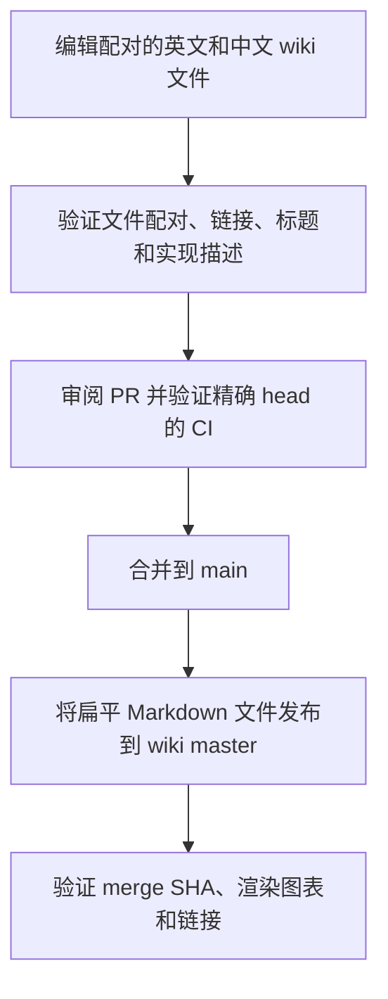

# Wiki 发布

[English](Wiki-Publication)

受版本控制的 `wiki/` 是唯一文档事实来源。每个主题分别使用英文 `<Page>.md` 和中文
`<Page>-zh-CN.md`，标题深度顺序一致、事实等价。标题和正文使用各文件的语言，不把完整翻译
合在一个文件中。描述必须对照当前实现验证，并在同一变更中更新两个文件。控制流和数据流
使用 Mermaid，两个语言版本结构等价、标签本地化。

Agent 加载日常上下文时只读英文文件。只有编辑或验证翻译时才读中文文件，不随英文版本
自动加载中文副本。`CLAUDE.md` 指向英文入口页。

跨页链接使用不带扩展名的页面名，除互相切换语言的链接外，保持当前语言。Checker 要求
每对文件齐全、拒绝旧语言分节标题、比较标题深度并检查链接目标。`Home` 列出全部英文页，
`Home-zh-CN` 列出全部中文页，两个 Crate Reference 文件都必须包含 Cargo workspace 全部
package 名。Checker 检查页面目标，不检查标题锚点；受影响的锚点链接还需在渲染后检查：

```sh
python3 scripts/check-wiki.py
bash scripts/test-wiki-publish.sh
```

`.github/workflows/publish-wiki.yml` 在每次推送到 `main` 后运行，包括每个合并的 pull request，
也支持 `workflow_dispatch`。它使用生命周期短、只限本仓库且具有 `contents: write` 的
`GITHUB_TOKEN` 克隆 `D0n9X1n/SonicTerm.wiki.git`。`scripts/publish-wiki.sh` 替换全部
扁平 Markdown；只有内容变化时才提交 `Publish wiki from <source-sha>`。Workflow 推送
`HEAD:master`，Wiki 的渲染分支是 `master`。重命名和删除都会同步；内容相同时成功 no-op。



网页端编辑不是事实来源，下次发布会覆盖它。该 workflow 不应使用 PAT、GitHub App private key
或其它长期凭据。

每次合并后，确认最新发布 run 对应 merge SHA：

```sh
gh run list --workflow=publish-wiki.yml --limit 3
gh run view <run-id>
tmp="$(mktemp -d)"
git clone "https://github.com/D0n9X1n/SonicTerm.wiki.git" "$tmp/wiki"
git -C "$tmp/wiki" log -1 --oneline
ls "$tmp/wiki"
```

若 `wiki/` 有变化，最新 Wiki commit 必须标识该 merge SHA；若无变化，run 应成功 no-op 且不
创建新 Wiki commit。最后打开在线 Wiki，点击具有代表性的英文和中文链接；workflow 成功本身
不能证明页面渲染和导航正确。
