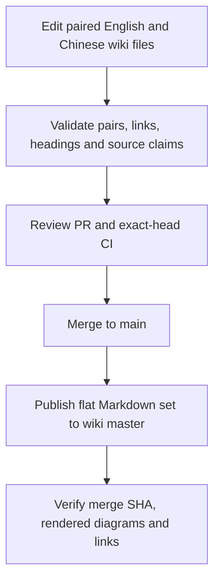

# Wiki Publication

[简体中文](Wiki-Publication-zh-CN)

The tracked `wiki/` directory is the only documentation source of truth. Each
topic has an English `<Page>.md` and a Chinese `<Page>-zh-CN.md` with matching
heading-depth order and equivalent facts. Titles and prose stay in the file's
language; full translations never share a file. Verify descriptions against the
current implementation and update both files together. Use Mermaid for control
and data flows, with equivalent structure and localized labels.

Agents load only English files for routine context. Chinese files are read when
editing or verifying translations, not loaded automatically with their English
counterparts. `CLAUDE.md` points to the English entry pages.

Cross-page source links use bare page names and stay in the current language,
except for reciprocal language-switch links. The checker requires both members
of every pair, rejects legacy language headings, compares heading depths, and
checks link targets. `Home` lists every English page; `Home-zh-CN` lists every
Chinese page. Both Crate Reference files must name every Cargo workspace package.
The checker validates page destinations, not heading fragments; check affected
anchor links in the rendered pages too:

```sh
python3 scripts/check-wiki.py
bash scripts/test-wiki-publish.sh
```

`.github/workflows/publish-wiki.yml` runs after every push to `main`, including
every merged pull request, and by `workflow_dispatch`. It uses the short-lived,
repository-scoped `GITHUB_TOKEN` with `contents: write` to clone
`D0n9X1n/SonicTerm.wiki.git`. `scripts/publish-wiki.sh` replaces the flat
Markdown set and commits `Publish wiki from <source-sha>` only when content
changed. The workflow pushes `HEAD:master`; the Wiki's rendered branch is
`master`. Renames and deletions propagate, and an unchanged mirror is a
successful no-op.



Browser edits are not source and are overwritten by the next publication. Do
not use a PAT, GitHub App private key, or other long-lived credential for this
workflow.

After every merge, verify the newest publication run corresponds to the merge
SHA:

```sh
gh run list --workflow=publish-wiki.yml --limit 3
gh run view <run-id>
tmp="$(mktemp -d)"
git clone "https://github.com/D0n9X1n/SonicTerm.wiki.git" "$tmp/wiki"
git -C "$tmp/wiki" log -1 --oneline
ls "$tmp/wiki"
```

When `wiki/` changed, the newest Wiki commit must identify that merge SHA. When
it did not change, the run should report a successful no-op without a new Wiki
commit. Finally open the live Wiki and click representative English and Chinese
links; workflow success alone does not prove rendering and navigation.
